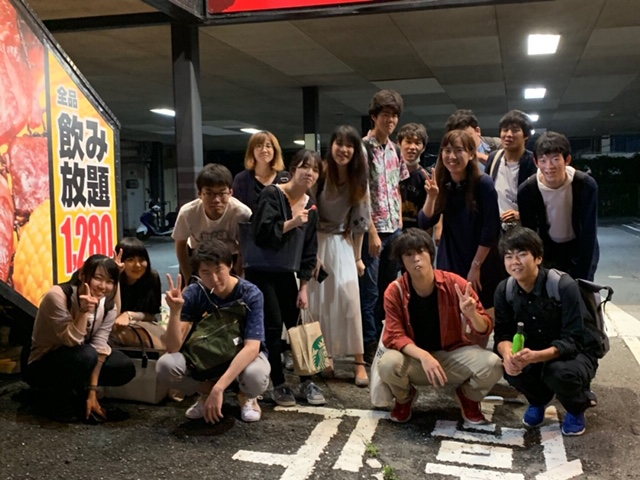
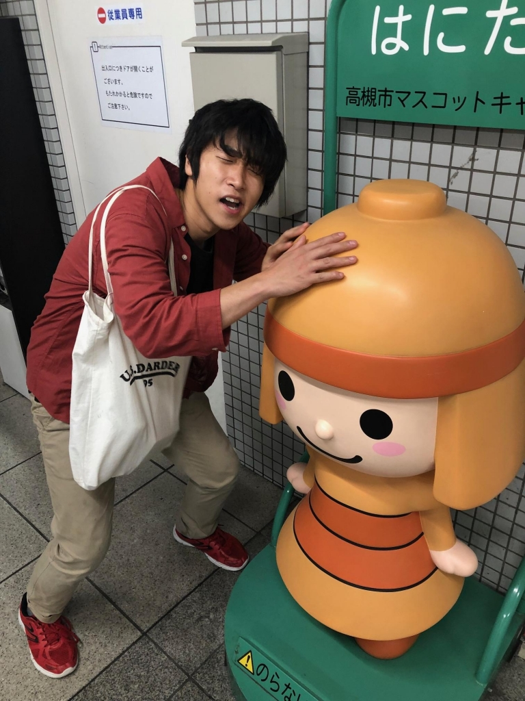

どうもカルピスです。

今日は焼肉屋「八苑」で、劇団かじおせいいっぱいのうち入りをしました！1回生は、打ち上げの経験はあってたも、うち入りをしたことあるって人は少ないと思います。最近だと、ご飯会だけじゃなくて、テーマパークに行って、アトラクションを体験したりするうち入りもあるので、僕も楽しみです。

久しぶりに焼肉屋に行きましたが、やっぱり焼肉はテンション上がります。といっても、僕の場合、1時間くらい食べ続けたら、お腹一杯になって、それ以降はほとんどたべられませんでしたが、、、。そんな状態でもアイスは美味しかった！何より、アイスの塊を削って団子にする器具あるじゃないですか？あれを使えたのが嬉しかったです。あれ、何処に売ってるんでしょうかね？アイスクリームや以外で見たことない、、、。

配役も決まり、明日から本格的なシーン作り。期待と不安で一杯です。最後の夏を存分に楽しみたいと思ってます。

iPhoneから送信

## どこに出しても恥ずかしい先輩

やっほっほーい！ぼくは3回生の つんつん！

こっちは高槻市のマスコットキャラクターの頭を いやらし～顔つきで撫でているマイチームの演出のそうちゃん！この夏はよろしくね！！

あ、ぼく実は芸名もうひとつあります！

あててみてください！ (配点 30)

それはそれとして今回のチーム、、、最高っすね！何が最高って同期がいっぱいいるところですね！ぼくの中で同期はちょー大好きな人たちなんで、いや～もう最高ですね！そしてそれと同時に24期は目標でもあるんですよ、なんていうかその、越えるべき壁？みたいな？

はい。この夏はお互い切磋琢磨しあいたいですね。(配点 30)

もちろん先輩後輩も くせ者ばっかでこれからの稽古がめちゃんこ楽しみです、、、っていうか本当に変な人達しかいないんですけど。

あー、この季節になると去年の夏を思い出しますね～。去年は新入生としてこの劇団に入ったので、丁度去年の今頃がぼくの初公演だったんですけど、いや～去年、めっちゃ楽しかった。何が楽しかったのかって言われるとそーですね、去年のチーム先輩方は全員「どこに出しても恥ずかしい先輩」だったんですよね。

あ、悪く言ってるわけじゃないですよ笑。

本当に メンバーがアホでアホで仕方がなくて、だけど本当に本当に面白くて、大好きな先輩

ばっかで、それがもう楽しくて楽しくて！

…よし！じゃあ

今年の新入生の「どこに出しても恥ずかしい先輩」になること

を今年の夏の目標にしちゃいましょうか！

幸い今年の2～4回生も 変な人間の揃い踏みなんで、それに負けないように変になりますよ～！

26期の3人が心の底から楽しんでくれることを祈って！！

以上！ラギトがお送りしました！

ばいばいぴー！！ (配点 40)
