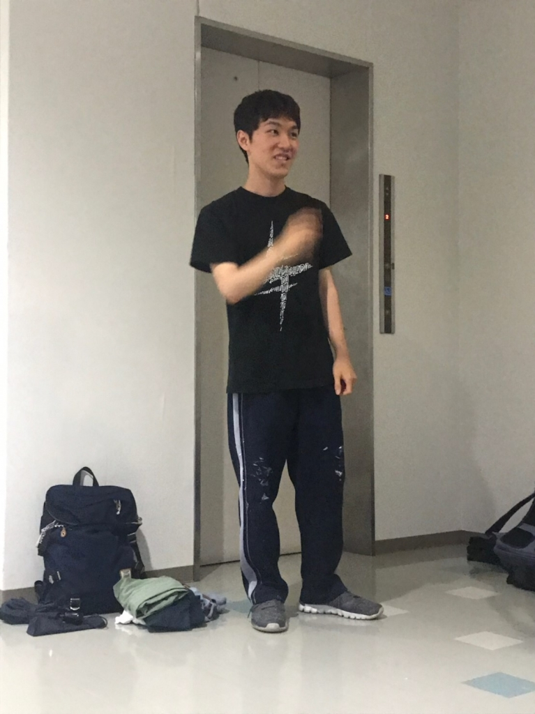

皆さんこんばんわジョージです。最近はずっと雨でずっとジメジメしてますねー。あと、天気予報全然当たらなくてなかなか困っています。まぁそんなことは置いといて、今日は基礎練で7ポーズ王決定戦をやったんですがとても楽しかったです。そして、キャラブレストをしました。これでシーンの段取り付とキャラブレストを覚えたので、あとはセリフ覚えとシーン作りですね。これから2ヶ月頑張っていきます！

## 初夏

このチームになってからは初ブログになりますね。お久しぶりです、ずかちゃんです。

最近特になのですが、時間の流れがとても早く感じます。ついこの前まで１回生だったのに、もう2回生、しかも夏！？という気持ちです。笑

後輩が出来て、また万での夏を迎えて

嬉しいようなわくわくするような、一周回って新鮮な、そんな気持ちで御座います。

さて。

今日はブレストをやりまして、台本の世界観やキャラの役割を掘り下げました。

今になって改めて思います。

「この台本、めっちゃいいな～～～！！！」と。

細かな事は話せないのですが…なんと言いますか、

このお話のテーマや方向性が大好きでして。初めて台本を読んだ時、色んな気持ちが湧き上がって心が踊ったのをはっきり覚えています。

微力ではありますが、このお話の世界観に少しでも染まれたらなぁって考えてます。

そんな近況報告でした。笑

写真貼ろうとしたんですが、不具合で出来ませんでした。かなしい。
