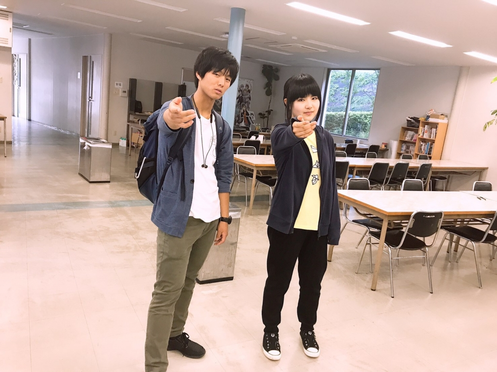

はじめまして、1回生の胡蝶です。

今回ついに順番が回ってきてしまいました。

ブログと言えば何を書けばいいのか分からないので、とりあえず今日の出来事を覚えている限りまとめたいと思います。

今日は10時～17時まで練習がありました。

7時間もあるのか～ってナーバスな気持ちでしたが、稽古を始めるとあっという間ですね。気づいたら17時でした。

読み合せをして、頼りになる先輩方にアドバイスしていただいたり…とにかく充実した稽古時間でした。

先輩から台詞読みの手ほどきを受けた後に読み合せをしたのですが、演出さんから上手くなってると褒めていただきました！あざっす！！

褒められて伸びるタイプなのでもっと褒めてください！

とまあこんな感じですね。

日々思うのが、優しい先輩方に囲まれて稽古できているのが幸せだってことですね。たくさん迷惑かけるかもしれないですが、どうぞよろしくお願いします。

これはブログ用の写真を撮るのに付き合ってくれたバーグさんです。
