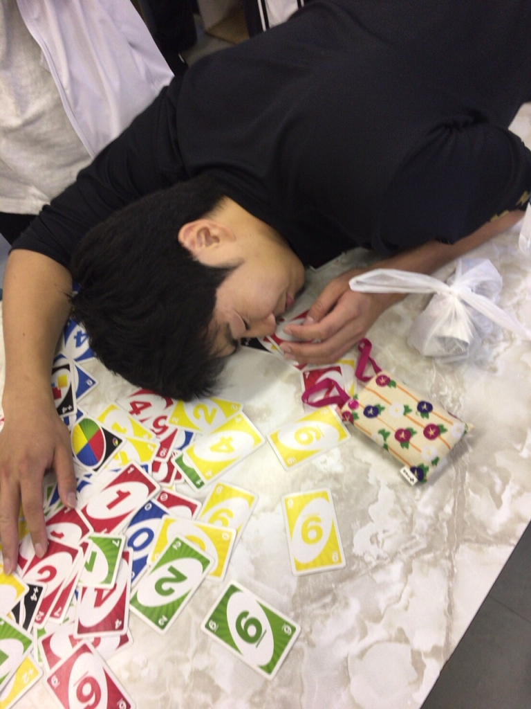

やっほっほーい！ぼくの名前はラギト！

こっちは闇のゲームに敗北して魂を奪い取られちゃった、おっきいわんちゃんのジョージくん！うーん、かわいそう～(涙)

もうセリフ締めきりがおわってシーン回し始めてます！やっと枷が外れたカンジです、封印されしものの右腕左腕右脚左脚全開放ですね！

これでシーン中にいっぱい変なことできます、そうちゃん楽しみにしててね！

セリフ締め切りと言えば、みなさん暗記するのは得意ですか？みなさんそれぞれ自分流の暗記方法があると思うんですけど、今回はぼくの暗記方法を特別に伝授します！しかも2つ！

両方とも大学受験中に編み出したんですけど

まず１つ目は…

暗記物を1ページずつ、何も見ずに音読していく方法です！簡単でわかりやすいですね！

ちゃんと口に出して言うのがポイントです！

上級編として白紙に一から書き出し方法もあります、超オススメです！

これは日本史の語句を覚えるときに塾の先生から伝授した暗記方法なんですけどね、この暗記法を使用した結果。

本番のセンター日本史でなんと、100点中100点の満点とれちゃったんですよね。これはすごい、さすが塾の先生ってカンジですね。アルバイトで塾講やってる人 すげぇ尊敬するんすよね～。

そして2つ目は！

覚えるもの全体を10個くらいに区切って、そのうちの１つを1～3日かけて覚えていく暗記法です！その１つを覚えている間に、区切った残りのところは見ないのがワンポイントです！

これは英単語帳に乗ってる2000個くらいの単語を覚えるために編み出した暗記法でありましてね、この暗記法を使用した結果。

本番のセンター英語でなんとなんと

2 0 0 満 点 中 8 6 点 も 取 れ ち ゃ い ま し た ！

どちらを使った方がいいかはもう明白ですね、当然ぼくは2つ目の方法で台本を覚えました！

もう長台詞もほぼ完璧です！

以上、つんつんでした！
