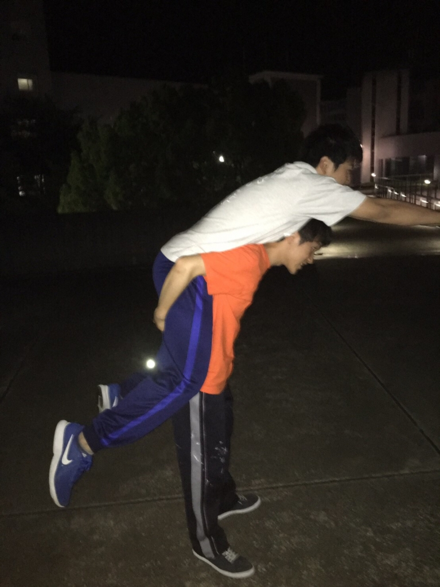

こんばんは！

昨日書くのを忘れていました。

どうも、ピクルスです。

どんどん暑くなり、本格的に夏を迎えそうになってきました。そんな中でも、みんな毎日稽古頑張っています！

シーンごとに動きなどをどんどんつけていくようになってきて、シーン回しも大変になってきていますが、しっかり練習を重ねて本番を迎えられるように頑張っていきたいです！

これからも暑さに負けずにみんなで頑張っていましょう！！

iPhoneから送信

## ひとりごと

おはこんにちは、こんばんは。早くも2周目のブログが回ってきてびっくりしてます、ずかちゃんです。

7月なのに、まだ梅雨っぽい日々が続きますね。皆様いかがお過ごしでしょうか。

そんな前口上はさておきまして

唐突ですが、皆様は夢をお持ちでしょうか。ベタなところだと、「○○になりたい」とか「○○したい」とか。「たい焼き食べたい」とかも、小さいながら1つの夢ですね。たいやきおいしいよ。

大なり小なり、千種万様あるかなと思います。

拙いものではありますが

今日はそんな、最近感じた夢のお話を。

最近、万で稽古をしていて強く思う事があります。

夢があるって幸せだなって。

なりたい目標、叶えたい夢は私にとって、とてつもなく大きな原動力です。

あんな風になりたい、これがしたい、そんな思いがふつふつと血を湧き上がらせるんです。

万絵巻の大きな特徴は、行動可能範囲内ならば

誰でも、どの夢にでも挑戦できる機会がある自由さにあると思います。場合によってはある程度条件が必要だとは思いますが、全員に、平等にチャンスがあるのは間違いありません。

それはサークルという場所、学生という立場だからこその特権。本当に有難い話です。

せっかくの機会、やっぱり

やれるだけの事はやりたいなぁって

最近は特に思わされるんです。これもまた1つの縁なのでしょうか、不思議なものですね。

これからもそうですが、何より今夏。やりたい事、たくさんあります。消化不良にならないよう、童心に返る気持ちでめいっぱい尽くしたいな

というひとりごとでした。

写真は、なんだか楽しそうなジョージさんとピクさんです

iPhoneから送信
