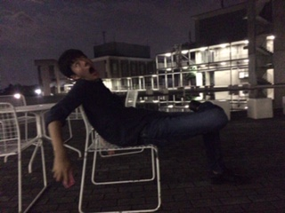

どうもジョージです。最近セミが鳴いてますね。夏ですね。この前ヤフーニュースでやってたんですけどセミって一週間以上生きるんですね。驚きました。今までずっと一週間だけの命なんて儚いからうるさくてもまぁいいかなーって思ってたんですけどなんかもううるさいだけですよね。あと、セミが地上にでてからの命が一週間超えるのを発見したのは高校生だそうですね。なんでもセミの羽根にマーカーで印をつけて調べたらしいですね。すごい根気があるんだなーって思いましたね。話はかわりますけど今日ライオンハートだと思って歌っていたら、夜空ノムコウでした。じゃあ今日はこのあたりで失礼します。

