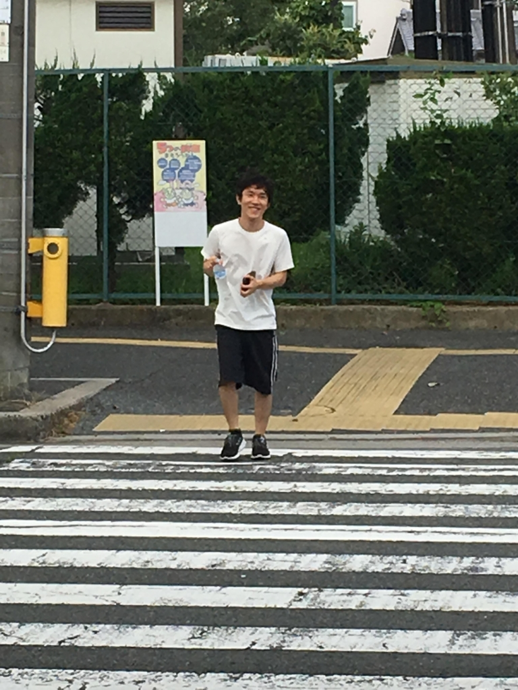

皆さま！ご機嫌いかがでしょうか！演出のカジオです！少し遅れてしまったのですが8/8に第2回通しをしました！パフォもopもつけ終わってちょっと一安心

通しを重ねるごとにみんなの演技もよくなってきています！しかし、夏はここからが勝負だと思っています！どれだけシーンやop、パフォの練度を上げれるかだと思うので少し足りとも時間を無駄には出来ませんね！

今年の夏も非常に暑いですけど暑さに負けずに頑張っていきたいと思います！

話は変わりますが最近うちのチームではずかちゃん語というのが流行っています。

その一部を紹介したいと思います。

例

「おふぇりあ」…①感嘆詞。漫画斉木楠雄のサイ難に登場する驚く時に用いる感嘆詞「おっふ」の応用後。同じく驚く時に用いふ

「オフェリア・ファムルソーネ」…①FGO登場キャラ、クリプター、②かわええ

だそうです。意味がわかりませんね笑

みんなもずかちゃんと触れ合う時に使ってみてください。

写真は水を買ってきたピクルスです
