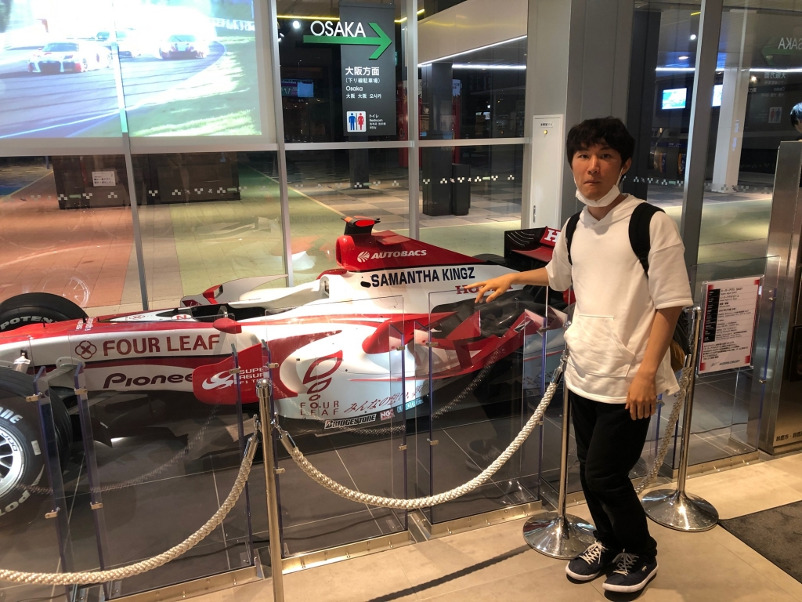

やっほっほーい！ぼくは3回生のラギト (つんつん)！

こっちは最近ふざけまくりなピクルス！ピクルスと共演できてすごく嬉しいです！それはそうとブログで本日食べたアイスのレビューすな

ドレパとパンフ撮影やりました！

ぼくが今までやってきた役の衣装にあんまりいい思い出ないんですけど、今回の衣装は結構気に入ってます。へへへ。

今回の役者さんの衣装の中では、特に同期のF1の衣装がお気に入りです。あんまり話しすぎるとネタバレになっちゃうので控えめに言いますけどね、それは本番までのお楽しみということで！

お盆休みということで思った以上にブログに綴ることがないんで、僕から見たチームのみんなの印象を書きます！

かじおチームのメンバーは一体どういう人たちなのかをよければ参考にしてくださいね！

【23期生】

・小田バーグさん

面倒見がとてもよくてよく頭がまわる、お菓子で例えるなら「しみチョコーン」

小田さんしっかりしてますよね。この間小田さんの本気の演技見てきたんですけど、セリフ回しが色っぽくてかっこよかったです。ここでいう色っぽい ってのは 男性女性のそれぞれの性別でしか出せない表現っていうかなんていうかって僕は思ってるんですけど。いや、よかったです。

23期のこと めちゃくちゃ好きそうなおっさん。脳にSiriが埋め込まれてるんちゃうかってくらい会話の引き出しがすごい。

好きな炭酸飲料は「スプライト」っぽそう。去年もばーぐさんとカルピスさんとおんなじチームだったんですけど、今年もおんなじチームになることができて 本当に嬉しかった2人です。面白いですもんね。

・カルピスさん

カルピスさん、お菓子で例えるなら「ねるねるねるね」舌が長くて、変顔が面白いです。何食ったらこんな顔ができるんかな？エチュードでおんなじ組になると一番嬉しい人。ランタイム伸ばすこと(変なこと)ばっか考えてるおっさん。すぐ自分の世界展開したがる人。好きな清涼飲料水は「三ツ矢サイダー」っぽそう。ランタイムランタイムランタイムランタイムランタイムランタイムランタイムランタイムランタイムランタイムランタイムランタイムランタイムランタイムランタイムランタイムランタイムランタイムランタイム、まあカルピスさんが盾になってくれているのでぼくはランタイム伸ばし放題なんですけどね。へへ。ついでにゼミの先輩。

【24期生】

・初代 (ゴンザレス)

えんしゅつ。お菓子で例えるなら 「ブルボンプチシリーズチョコチップクッキー」梶尾ママ、家事全般なんでも出来そう、かじおだけに (部屋がゴミ汚いけど)。24期一人暮らし勢の中で一番料理できるんちゃうかな？いや～、一人暮らし勢適当な人間ばっかやからな～。帽子がめっちゃ似合う、テニスやってそうと思ってたら案の定テニスやってた。テニプリのレギュラーモブにいそう。モブ主演賞。えんしゅつがんばってます。ナタデココゼリーを食べる時にナタデココは最後まで取っておきそう。それとスマブラで「キャプテン・ファルコン」を愛用してそう。

・マッシュ

えんしゅつほさ。お菓子で例えるなら「フェットチーネグミ」24期の中ではジョージと1、2を争うくらい生活力あるよ多分、マッシュやからな～。みんなマッシュこわいって言うけど ぼくはあんま怖くないと思ってます。ジョージが変なこと言ったら高確率で笑ってるしな～。Nintendo Switchのコントローラーを取り外す時は左→右の順番で、逆に右→左の順番でコントローラーを本体に取り付けてそう。ついでにマッシュは人生ゲーム強そう、絶対。それはそうとゼミ頑張ってください、かじおチーム一同おうえんしてます。

・ジョージ

おっきい犬。お菓子で例えるなら「コアラのマーチ」ジョージはね～、なんでもできるよ、しかもむだに博識やし。一家に1ジョージ欲しいですね。ジョージやさしいからな～。マリオカートでラストラップでゴールする瞬間に ホールドしてた「みどりこうら」を後ろにシュートして後続のレーサーを邪魔してそう。あれは許せないですね(5敗)。第一印象がなんか怖かったです、おっきいからしょーがないですね、笑い声もすごいおおきいし。ジョージすぐ先輩後輩にちょっかいかけるからな～ (´；ω；\`)

ジョージがスタンド能力に目覚めたら「ハイウェイ・スター」か 「D4C」「メイド・イン・ヘヴン」あたりが出てくるよ。ジョージすぐスタンド出したり、闇のゲーム始めたりするからな～。なんか最近果物のゼリーばっか食べてる。何で？強靭な肉体の秘訣は果物ゼリーなんか？この謎を解明すべく我々はジャングルの奥地へと向かったのであった。

・F1

フォーミュラ ワン 鈴鹿。お菓子で例えるなら「たべっ子どうぶつ」めっちゃ愛想がいいおねえさん。すぐ笑う。めっちゃ年上感ある、あ、2歳上やからか。現座長とおんなじくらいサボり癖あるからな～、これは小綺麗なゲゲル。鈴鹿って芸名めっちゃいいと思うんですけど消滅してしまったの惜しいですね。公演の衣装がいちいち面白い。好きなラーメンスープの味は「塩」っぽそう。前世はオアシズの光○靖子かなんかか？万絵巻で一番 いらすとや が似合う女。めっちゃ三重県って顔してる。実際三重県。4ヶ月前にF1がぼくの家に鍋を置いてからずっとぼくの家に鍋が置いてある。これが三重県か。ちなみに光○浦靖子さんは愛知県出身らしいです、、、、、隣か～！

・ジンジャー紅

じんじゃ。お菓子で例えるなら「PRETZ」

ジンジャー、森羅万象あらゆる事象を鼻で笑い飛ばしてそうなかんじする。帽子とジーパンがめちゃ似合う。好きなアメリカの州は「オハイオ州」っぽそう。ジャングルに一人取り残されても原住民の人と仲良くなって生き残ってそう。免許合宿おうえんしてますがんばって。ジンジャーにドッペルゲンガーがいたら、そのドッペルゲンガーはアメリカでPRETZ加えながら深々と帽子を被ってスケボーで大回転決めてそう。ヒューッ！

・ピクルス

ピ。お菓子で例えるなら「グッピーラムネ」ピクルス結構ふざけてるところあるからな～、シャララ シャンランララ マジで感謝。

ピクルスって意外と 運動できるし、ゲームも結構うまい しかも単位もほぼ取れてる。うーん、やるやん！暇になったらすぐボールで遊び出すよ。ポイフル食べる時 一粒ずつ食べてそう。好きな鳥は雀です。そういえば最近100均のバイトやめたそうです、マジかよ～。好きな都道府県はぜったい「高知県」でも結婚するなら「奈良県」最終的に「栃木県」の一軒家に住んでそう。イラレの使い方教えてくれて本当にありがとうございます。それはそうと勇者のギガデインがつよすぎる。今年は彼と行くキャンプがものすごく楽しみです！これからもよろしくね！

・電竜丸

まるちゃん。お菓子で例えるなら「チョコあ～んぱん」なんかこわい。最近ソシャゲやってる。新入生にやさしいよ。特にゲーム方面の会話の引き出しが多いかも。いや～、まるちゃんがおらんかったらぼく同期とうまくやってけんかったかもしれへんな～ってくらい、ぼくと24期の架け橋になってくれました、ありがとうございます。好きな袖の長さは「七分袖」っぽそう。

彼はよく後輩を連れてご飯行ってます、体型に違わず太っ腹ですね、わりとそこ尊敬してます。ちなみにぼくも体型に違わずケチです。ごめんなさい、お金さえあれば奢るんですけどね？ほんとですよ？

【25期】

・パワプロくん

ぼくのこと大好きやろ？パワプロ君、すぐつんつんに話しかけるからな～。お菓子で例えるなら「コロン」めちゃくちゃソシャゲやり込んでる、かなりつよい。最近頑張ってる、ぼくも応援してます、がんばれー。パワプロ君が稽古場来るのこの夏が初めてかもしれないですね。つんつん式就職診断メーカーによると将来の夢は「アサシン」がいいと算出されてます。獲物はベンズナイフがいいですね。去年もおんなじチームだったんですけど彼と行くキャンプはとても楽しいですよ！

・しずかちゃん

川ちゃん、FGOがめっちゃ好き。お菓子で例えるなら「ポリンキー」人に迷惑かけまくるタイプの凡骨。オフェリア・ファムルソローネ。おにいさん 君の将来が不安です、強く生きて欲しいものです。無明三段突き。でも彼女のいいところは話しやすさだと僕は思ってます。それを生かせるような職場につくことを祈ってます。いちごのショートケーキを食べる時 上に乗っかってるイチゴは途中で食べてそう。ツイッターがやばい。あ、最近【ずかちゃん語録】というものがかじおチームで流行ってるらしいですね。

はっ…はっ…はっちちちちち！ (手汗を膝で拭きながらくしゃみする音)。ヨーイ、ア！んにゃ！あにゃ！あにゃすー！にゃんにゃん！オフェリア！ころすー！ズカちゃん、ナイチャウ!

う～ん、これは人間の発する言葉とは思えない。死霊の言葉かもしれないし、川ちゃん イタコさん 向いてるんちゃうかな！つんつん式就職診断メーカー的にもゴーサイン出てますよ！おー、すっげぇ シャーマンキングじゃん！よみがーえーれー！

・コロ助

コロちゃん。お菓子で例えるなら「柿の種」ラーメンで例えるなら「豚骨醤油」コロちゃんめっちゃやさしいからな～、すぐお見舞い行くよ、コロちゃんは。お見舞い厨。ぼく25期と同時期に入ってきたから後輩感全然ないけど、それでもたまに「コロちゃんかわいいな」って思う時がありますね、今ぼくが後輩に欲しい人間NO.1は君だ！コロ助！

でもコロ助すぐ 知ったか するからな～

前世はぜったい「しば犬」

お金に強い、流石は銀行マン志望やな？

めっちゃ「富山県」に実家ありそうな顔してるのに、ふつうに大阪。小学校の給食の時間でぜったい 余り物のプリンをかけてジャンケンしてるやろ。はっ…はっ…はくちっ！恥ずかしいポヨ～&#9825;

【26期生】

・胡蝶

こっちゃん。お菓子で例えるなら「ぷっちょ」ポケモンが好き (メタグロス)。ぼくもポケモンすき(フライゴン)。茶道部の部長さんしてたらしいです、なるほど。それと空手強そうなイメージです！黒帯保有してそう、、、！まさしく日本人の鑑みたいな？ヤマトナデシコみたいな？これはアツイ！衣装として頑張ってくれてます。もし今回のぼくの衣装がこっちゃんが出した案なら、一生ついていきます。「つんつん」じゃなくて「ラギト」の芸名の方で呼んでもらいたかったんですけど「つんさん」って呼ばれたんで、やむなしですね。いい呼び名じゃないですか、つんさん。あ、新入生歓迎会の時にピクルスと一緒に「イナズマ部長」って芸名案だしたんですけど、ぼくはまだ諦めてないですよ！「こちょう」と「ぶちょう」、、、ほら！結構近い！なのでまずは「イナズマ胡蝶」から定着させていきましょうかね、そして最終的には「イナズマ部長」に、、、！

・ナダル

声がいい。お菓子で例えるなら「カントリーマアム」出来る男と思いきや結構抜けてる場面あるぞ、これギャップって言うんですよね、知ってますよ！ナダくん本体を触媒にしたら召喚されるサーヴァントは「トリスタン」だと思いますね。パソコンの起動のパスワードに自分の苗字と誕生日入れてそう。ついでに「福岡県」に住んでますって顔してる、全然関係なかったけど。彼もとい今年の新入生(26期生)には「つんつん」じゃなくて「ラギト」の方で呼んでもらいたいものですね (1敗)。あ、ちなみに僕の中でナダくん変態説出てます。金曜に行ったドレパ&パンフ撮影の時にこっちゃんの上着とスカート着て変なポーズとってました！なるほど、イケボと女装癖の両立、、、これがギャップか、参考になります。参考にならなくても参考にします。

・おかしら

おかちゃん。お菓子で例えるなら「おっとっと」ぼくの知り合いのなおひさ君に似てる、顔が。まだ話したことがないので、これから仲良くなりたいです。おかちゃんの役者姿を早くみたいものですね、これからの彼の活躍には期待してます！ちなみに知り合いのなおひさくんは最近ポケモンGOにハマってます。そこで、おかちゃんをポケモンに例えるとするなら「ゴウカザル」かな！

おかちゃんの役職はどうやら大道具みたいです。いや～、今年も大道具は安泰ですね。

好きなゲームのジャンルはぜったい「FPS」やろ。ついでに好きな漫画は「GTO」っぽそう。ぼくもGTOだいすきですよ！ちなみにぼくの好きなGTOのシーンは杏子の「よ 吉川にぃ～～～～～っ！！？」ってところです。

・コールドPグランデ

なんてすごい名前なんだ全く、名付け親の顔が見たいですね、、、あ、洗面所に映ってました。お菓子で例えるなら「LOOK」みんなコルピーって呼んでるけど、僕 あまのじゃくなものでですね。みんなが呼んでるようなあだ名で呼ばずに僕独自のあだ名を付けて呼ぶことが多いんですよ。なのでコルピーのことは「グランデ」「グラさん」って呼びたいと思ってます、真似した人はゆるさないです！覚悟の準備をしておいてください！いいですね！それはそうとコルピーのメガネを外した時の顔めちゃくちゃカッコいいと思ってます。(あれ？メガネしてますよね？)…どれくらいカッコいいかって言ったら 真夏の太陽が照りつける日に洋楽を流しながら海沿いの道路をサングラスして、窓に左手を掛けながら片手でハンドルきってオープンカーで爆走しているくらいの情景が思い浮かぶほどにカッコいいです。って結局グラスで顔が隠れとるやないかーい、わはは！実際グランデの芸名は洋楽をよく聞いているってところから付けたのでもしかしたら本当に オープンカー走らせてるかもしれないですね。

以上です、長々と申し訳無いです。

↓簡単にまとめました

23期 おっさん (チームいっしょでうれしい)

24期 おおい (だいすき)

25期 やべーやつ (くせがつよい)

26期 がんばれ (ラギトってよんで)

ブログ超長くなってごめんなさい！

以上、つんつん (ラギト)でした！

## 夏は短し

最近は本当に気温が上がって息をするのもしんどいですね…みなさんも水分と塩分の補給をしっかりとして熱中症対策しましょう！

ってことで、どうも最近仮免許の期限が近づいてきて焦りを隠せないまるです！

明日はなんとドレリハです！

なんというか時間が経つのって早いですね～ついこの間始まったと思ったらもう夏が終わっちゃうなんて…万で演技できるのもあと少しになってきたんだなと思うと感慨深いですね

そうそう、ドレリハといえば僕の衣装を今日着たんですけど夜王さんに無茶苦茶かわいいって褒められました！いや～、照れちゃいますね～ってことなんで皆さん楽しみにしていてください！

p.s.写真の夜王さんを見ていると見ていると夏吠えを思い出しますね～

あと、マキさんはなんと0.1トンになったらしいです
