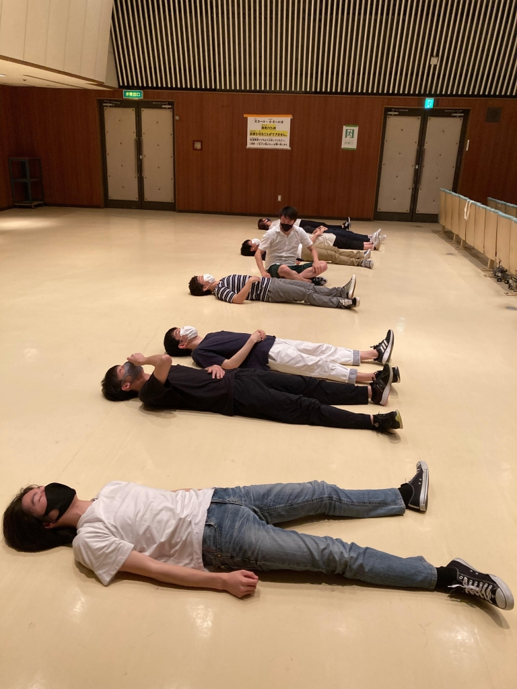

おはようございます、こんにちは、こんばんわ！お久しぶりです！（誰に対して？）

4回生のどらごん小次郎です！はい！4回生です！ちなみに25期生です！記念すべき4回生になって初ブログです！

とうとう夏公演の稽古が始まりました！今までコロナ禍の影響や個人的に忙しかった事もあり、久方ぶりの演劇です！そしてなんとびっくり演出です！！いや、ほんとワケわかんないですね～

まさかね、ぼくもね、演出するなんてね、思ってなかったワケですよ、ほんとに。でもね、気がついたら、演出です。がんばるしかねえな～

なんて言ってますが、本質はそうそう変わるものでもございません。優秀な同期や後輩に支えてもらいながらどうにか立っていようと思います。ほんとみんな助けてね。ありがとう。

と言う感じなんでね、先輩の皆々様、稽古場来てください！演出補佐急募してます！補佐は何人いてもええですからね～

ではでは、大雨や急な暑さなどにも負けないように、今まで以上に体調のことを意識しながら、元気よくお過ごしください。

あー、写真はですね、稽古始まって一時間くらいの時に撮ったやつです。

ん～、みんな寝てます。

このチームやっぱダメかもしれない…

