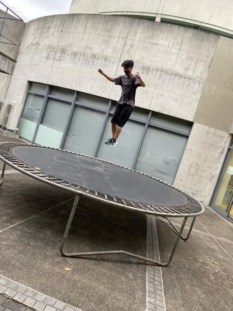
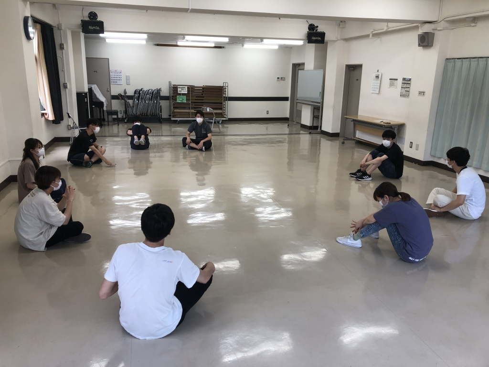

こんにちは、こんばんは

4回生のさつきです

ついに最後の夏がやってきてしまいました

全てのイベントに「最後の」が付きまとうやつですね

僕にも来ちゃったかぁ、まぁみんなにもいつかは訪れるわけですが

まだ全然実感湧かないんですけどね！

最後だろうが何だろうが、やることは変わりません

全力で楽しむ

これを肝に銘じてこの1年、万で過ごす最後の1年を過ごしたいと思います

夏の話をしましょうか

やっぱ夏は楽しいものですよね！

他の公演と大きく違うところは万のメンバーがチームに分かれてそれぞれ異なる公演をうつことですかね

このチームで夏公演の約2ヶ月間を過ごすわけですが、

演出の違いでこのチームの色というか、雰囲気が全く違うものになるところも面白いところだと思います

今回のチームの演出は知っての通り、どらごん小次郎くんです（写真の子です）

ドラゴンじゃないですよ、「どらごん」ですよ

竜じゃないですよ、「どらごん」ですよ

とても大切なことなので2回言いました

つまり、チームの雰囲気はそんな感じってことです

分からない？

それなら、遊びに来てください！きっと意味が分かると思います

それではお待ちしております

## 夏が来た！

みなさんこんにちは。4回生の殿です。

いきなりですが、夏公演がやってきました！

あまり役者をやらない僕ですが、夏だけはずっと役者をやっているんですよ。 

だって、夏公演って単純にいっとう楽しいじゃないですか。個人的に一年の中でもっとも楽しい公演が夏公演だと思っているんです。そして楽しいことをやるのが嫌いな人なんて居ませんよね。

せっかくだから役者として積極的に関わっていきたいじゃないですか。

今年のチームも楽しくなりそうです。いつもの如く愉快な後輩たちはほんとうに愉快です。中には一緒に稽古をするのは初めての奴も居るし、今から楽しみです。

そして、まだ会えていない人もいるけど新入生も良い子です。まだまだ慣れない環境でしょうがこれから稽古を通じてどんな顔が見えてくるんだろうとワクワクしますね。

そしてもちろん頼れる同期がいます。同期の中でも人を楽しませるプロみたいな奴らが同じチームなので、面白くなりそうです！

どうぞ皆さん、どらごんの酒場を楽しみにしていてください。

稽古場や舞台で会えるのを楽しみにしています。

最後に。

まだ始まって間もないですが、このチームは絶対に良いチームになると感じています。

だって、この稽古場には笑顔が溢れていますから。

（写真は稽古の休憩時間にしてた新入生の芸名会議です）
