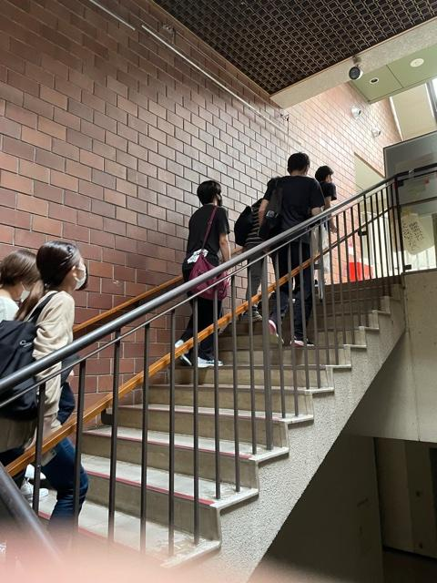

お久しぶりです、3回生　ナダルです。

こうしてブログを書くのは随分と久方ぶりなような気がしますが、よくよく考えると別にそうでもないのです。

というのも、新歓の期間がとても曖昧模糊としていたため稽古、本番が終わってもブログをだらだら更新していた時期がありまして、その影響か特に気負うでも無く、駄文を書き連ねることができるというものです。

とはいえ、新歓が遠い昔のように感じるのも事実。

時間が過ぎるのがここ何年加速度的に早くなっていく老人病を患っている事を自覚するのは悲しいものがあるのかしらん。

とまれ、夏です。

夏稽古といえば多くの障害が私たちの心身を痛めつける事は演劇経験者の皆様ならご存知でしょう。いえ、何も演劇に限定する必要は特にないのですが。

仕方のないことではありますが、急な日焼けや脱水症状は怖いものがあります。ええ、どちらも対策はしっかりしなければ。

しかし、ラピ○タで経過する都合上、最も問題なのは蚊虫だと私は思うのです。稽古が始まってまだ1週間ですが既に7箇所やられました。しかも全部足。許せねぇ。○す。

ここ数日は生憎の雨でやっていませんが、晴れたら蚊取り線香でも焚いておきましょう。

夏の脅威と戦いつつも、「どらごんチーム」で楽しい稽古ができればなぁと。

これを読んでくださった方、是非　遊びに来てください。

出来れば水かアイスか蚊取り線香の差し入れと一緒に。

待ってます。

待ってます。

待っています。
