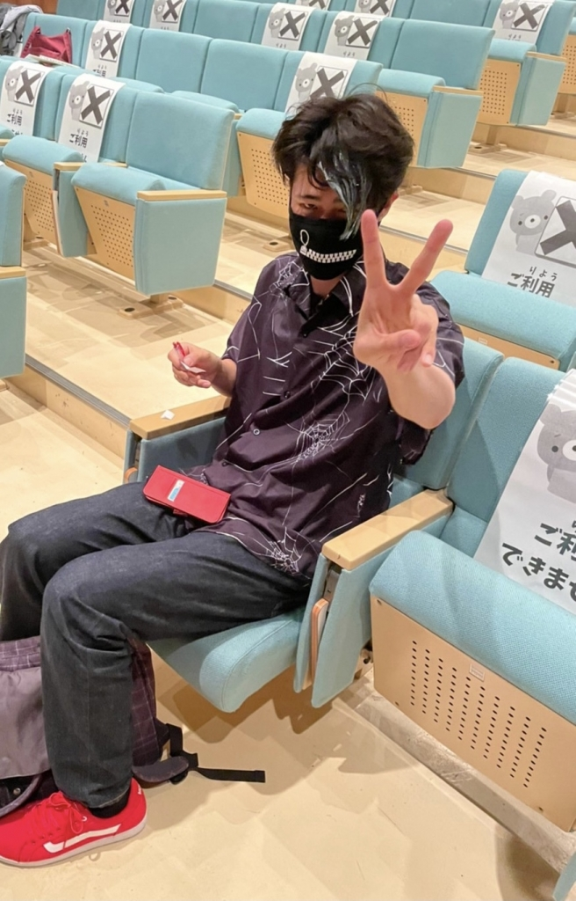

どーもです！花子です。

昨日はなんとですねぇ、ベルさんが稽古場にき

てくださいましたああああー！！！！

ああ、ベルさんのエチュードすごかったです

ね。さすがって感じです。

とにかく上手いなぁが最初にでてきます！

私はエチュードめちゃ苦手なのでやりたくない

けど、見ている分には最高におもろいですねー

最近はエチュード終わった後、その出来によっ

て正座してダメ出しを聞くか、立ってダメ出し

を聞くか決まっているようです。

私は立ってダメ出し聞いた記憶ほとんどありま

せん。泣けます。涙ぽろぽろです。

エチュードのない世界線に行きたいとすら思っ

てしまいます。

ですが、もうすぐテスト1週間前で稽古がありま

せん。きました。エチュードのない世界線…！エチュードないと思うと嬉しいし、みんなに会

えないと思うと少し寂しくもありますね。

稽古は稽古、テストはテスト！

さあ、何事も気持ちの切り替えは大切です！

これからも頑張っていきましょううう！！！！

## 無理のない課金は「無課金」ですんで

どもどもどーーーもっ

この前出したブログのタイトルを即パクられました、太宰晴吾です！

容疑者に話を聞いてみたところ「え、知らんかったわ笑」と返されました。いや、みんなのブログ読みなよっっっ

さて、前回のブログで「次書くときはもっといっぱいかける気がする！」みたいなことを書き残したのですが、予想以上に「次」がはやくて驚きました。前回書いたの3日前とかではなかったかな…？？お察しだと思いますが、今回も大したことは書けませんすみません。

花子も書いてましたが、昨日は万絵巻22期のベルさんが来てくださってました！これも花子が書いてましたが、エチュード凄かったんですよ。舞台意識とか発声とか、ほんとに色々と勉強になりました！

OB・OGの方たちとの交流の機会が多いのは、万絵巻の魅力のひとつだと思います。

OBさんといえば、この前24期のラギトさんも見に来てくださいました！変わらず明るくて面白くて、新入生とも楽しそうにお話されてました。

卒団しても遊びに来てくださる先輩方がいるというのは、なんとも嬉しいことですな！！

まだまだ遊びに来てくれることを信じて、楽しみにしてます～

ではでは、短いですが今回はこのへんで…

今日は、「ブログを書き忘れた罰」を受けながら稽古してきます…このお話は、また誰かがしてくれることでしょう笑

それじゃあ、稽古いってくるはる～
