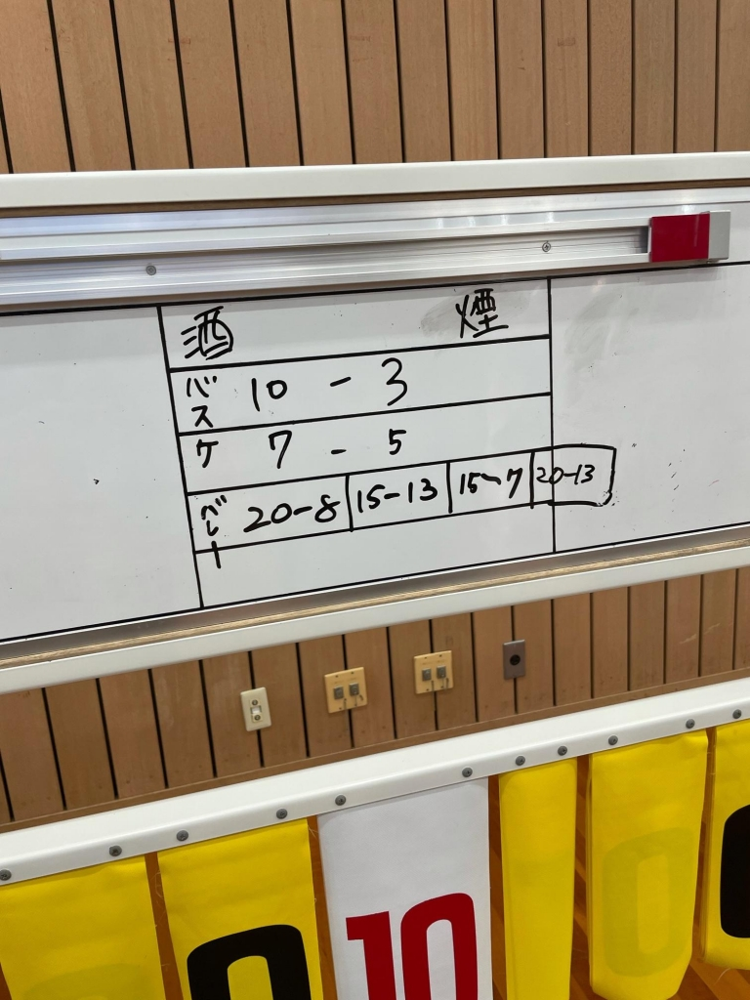
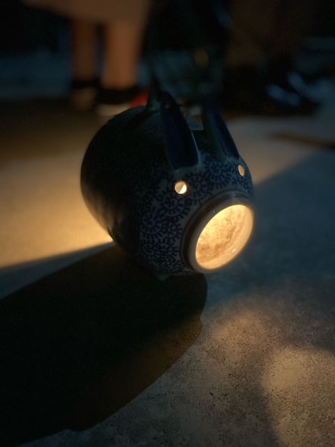

体を斜に机に凭りて、眼を半眼に塞ぎつつ頬杖支きたるは、参回生灘なり。その容の不壊と見えたるが、彼の気迫は繊弱なり。平常であらばその眼冷淡なれど、その腕、その脚は地平を驀地せんと淋漓してあらざれば、高らかに勝鬨を上げる益荒男であった

　**然し、先述の如くして熾日の眼はかすみ、薄墨を流さんばかり。幸に痰のごとき醜きものにはあらずして、莞爾す面目は役者なれど風采に活気失せて、その居座り、背後には相見るごとに鬼気ありて、人の膚を襲うなり。是ぞ将に手弱女と言ふ様子。**

　**さて斯様な容に成り果てるも、さして深きゆゑあらず。近頃世を騒がす流行病へ備えんと、vakzinなるものを左の腕にすわと打ち込み一昼夜、これが副反応かと冷や汗一筋。詰まりはそう云う訳である。**

　**ははぁ、此れは不可ないなぁと謂って笑うも、この様子は傍から見れば戦慄っ引きであろう。とまれ、これで今後の憂慮が一つ片付いたかと思えば相応の対価なのでは無いのかしらん。**

　**と、私事はここまで。あくまで此のblogはどらごんの酒場のものですからね。**

　**題名にもあります様に、今年の夏は天気晴朗にして熾日赫赫として炎煇燬くがごとし。逆蜻蛉で口をつけて水を飲み、砂を煎るような日々でありますから自分も溽暑の伊鬱を感じざるを得ないわけで、岐阜へ避暑に赴く前などは火傷したように蚯蚓腫れじみた日焼けなどして眠れぬ夜を過ごしてものでした。爾来、日焼け止めは手放せぬと鞄に突っ込んでいるものの、その時となると忘れるは人の習いか。**

　**万の夏といえば、色々な物の進捗が滞る事が常ではありますが、今年の稽古に関していえばその限りで無いと言えるかもしれません。一回生は真面目で良い子達ばかり、上回生も皆頼り甲斐のある人達で正に進路宜候と言った所でしょうか。ちょうど最近、Twitterのヘッダーも海に臨むかのような写真に変わってらしいと云えばらしいかもしれません。空ですが。**

　**とはいえ夏は未だ半ば、今後更なる艱難辛苦が待っている事でしょう。つい先日も、小道具締め切りを過ぎて全ての作業が終了している人が実質零人という結果でしたのもその証左と言えるでしょう。**

　**此のblogを読んでらっしゃる方がいるならば、不安に耐へつつ公演を楽しみにして下さればと。**

本日は、糞読みづらい文豪風味でお送りしました事をここにお詫び申し上げます。

お詫びに、ボロ勝ちした球技大会の点数を添付しておきましたので、どうぞご自由にご覧下さい。

## 頑張れ海馬ちゃん

こんにちは、こんばんは

4回生のさつきです

お盆休みにブログ書いてと言われたのに気づいたら休み終わってました

ごめんなさい

お休みはとても充実していました

充実し過ぎていたからか何したかあんまり覚えてません

ん、ボケてるんか？

でも、写真フォルダを見返したら記憶が蘇ってきました

写真に記憶を頼るからこんなことが起こるんですかね

しっかりと海馬を刺激していきたいと思います

結局何をしたかざっくりと羅列します

サーティワンアイスケーキパチパチ

半強制ぼっち焼肉待機

妹の作った韓国料理辛すぎ（美味しかったよ）

具沢山ピッツァ作り

リモートアマアス

キラキラ坂MMA

花火って儚いよね

並べて見てみると食べ物ばっかりですね

詳細が気になる方は僕に聞いてくださいね！

自分で想像するのも良いですね

まぁそれにしてもお休みあっという間でしたね～

気づけば夏稽古も終盤に差し掛かってまとまった休みはもうありませんね

んー、でもあんまり稽古した記憶がないぞ

やっぱりボケてるな

いやでも、まだまだしないといけないことが山ほどあるはず

稽古終盤、今一度気を引き締めて稽古に臨みたいと思います

## ちりも積もれば山となる&#9968;

ブログ投稿2回目になります、江戸川一栞（いちか）です！(● &#707;&#822;&#840;&#768;ロ&#706;&#822;&#840;&#769;)&#2669;&#43045;&#8318;&#8318;

今日はお盆休み明け初めての稽古！自分はワクチンの副反応で熱が出てたこともあって、かなり久しぶりの稽古になります！

そんな中、今日の始めの練習はダンスでした~！&#128131;いやぁ、ダンス難しいですね… T^Tトホホ…なかなか覚えられず、良くロボットのような動きをしてしまいました~笑笑　要練習ですね！&#128170;

次に、第6シーンの練習をしましたが、久しぶりの稽古だからでしょうか、、、全然声が出せませんでした T^Tやはり、日々の積み重ねって大事ですね~(\*´∇｀\*)

稽古も残り数週間！頑張っていきます！！

そういえば、10時～14時の稽古っていつ昼ご飯食べれば良いんだろぅ&#129300;
