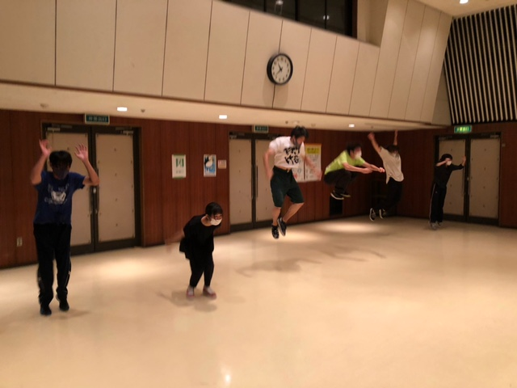

夏なのにもうずっと雨でじめじめした天気が続いていますね

夏ってこんなに雨降ってましたっけ？

夏なんだからカラッとした天気になって欲しいものです

申し遅れました

4回生のさつきです

え？つい先日もお前ブログ書いてたやろでしゃばるな？

ごめんなさい、ブログは指名制なのでこんな事もあるんです

ところで、最近の稽古のお話です

最近の稽古では体を酷使することが多いなぁと思います

ここって運動部だったかなと思うほど体動かしてます

演出が元気っ子なので仕方ないですね

ちなみにチームのみんなも元気っ子なので喜んで体を動かしています

でも歳なのでしょうか、体を動かした次の日は

みんな体バキバキになってます

あ、筋肉が急速に発達したという意味ではないですよ

でも定期的に筋肉痛になるので、夏終わりにはみんな筋肉バッキバキになってるかもしれませんね

目指せ刃牙

稽古も終盤、

演技も筋肉もブラッシュアップしていきたいですね

## タイトルは山の中

みなさん こんにちは。殿です。

最近はまた少し暑くなってきましたね。そして本番が近づいてきている事もあり、チームのみんなも稽古にどんどん熱が入ってきました！

そしてブログをいつも読んでいる熱心な方はご存知でしょうが、私たちのチームはとにかくよく体を動かします。稽古に熱が入るのに合わせて遊びも増えて、鬼ごっこやだるまさんが転んだなんかもしました。懐かしいですね。

みなさん子供の頃にする遊びで何が一番好きでしたか？

僕は「探偵」が好きでした。伝わりますかね、これ？アレです。捕まえる側と逃げる側に分かれる奴です。はい、「ケイドロ」とか呼ばれたりもするアレです。

いろんな呼び方がありそうですよね、こう言う遊びって。いやー、懐かしいな。比較的大人数いないと出来ないんですけど、助けることができたりと、走るのが苦手でも楽しみ方はあるのが良いところだと思ってます。ええ、走るの苦手ですからね。

さて、本番までどんどん日が近づいて来ましたが、こちらも最後まで気を緩めず走り抜きたいですね。

ではでは、また会いましょう。

写真は、数日前の稽古でやった「たるえだ」での光景です。みんないいジャンプしてました。

## だんす

こんにちは、花子です。

最近になってやっとダンスの振りを覚えてきた

なぁと感じています。今回ダンスの振り付けは

撫子と太宰がやってくれています。

めちゃかわいいダンスに仕上がってますねぇ。

うん……、かわいい…！

稽古の帰りに2人がダンスの振りを考えると言

って太宰の家に集まっていたので私もお邪魔し

ました。

お邪魔したのはいいものの、

寝て起きたらダンスが完成していました…。

最後にカメラマン役で動画撮影だけして帰りま

した。

うーん……、そーですよね、分かってます。

私は特に役に立ってません。

それどころか、私がYouTube見てて、これいい

んじゃない？と言った振りをしっかりダンスに

取り入れてくれてるんです。なんていい人達な

んでしょう。感激です。

今回の夏公演は撫子、太宰が考えてくれたダン

スにも注目です！！

ではまたー！！
