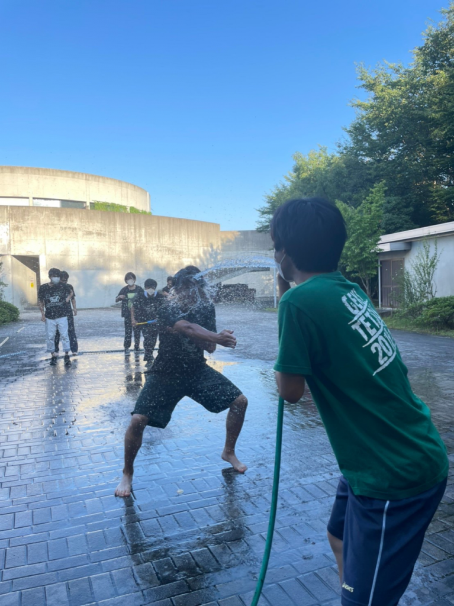

近頃はようやく晴れが続き、傘を持ち歩くという気鬱から解放されて清々する三回生ナダルです。

　さて、題名にありますように夏の万の風物詩とはなんだと思いますか？クソ熱い建て込み？やたら多い虫？

　いえいえ、こういう物が思い浮かんだ貴方はまだまだ、万初心者です。それか、万を忘れ始めているのかもしれませんね。

夏の万と言えばですよ。

***水遊びだろぉがよぉぉ！！！！***

　s棟裏のホースから水を引っ張って来て、アホみたいに水を被ったり、ホースに向かってアメンボダッシュする。それが万です。例年であれば、唐突に始まるこの行事ですが、流石に今年は事前に予告がありましたのでほぼ全員替えの服を持って来ていたのは偉いですね。

　というか、普通は夏の暑さに耐えかねて始まる物なので真昼間にやるのが正解なのですが…今回は夕方、日光が山に遮られ始めた時間帯にやったのでクソ寒いですね。水浴びエチュードとか水浴びセブン坊主とかやってる間に指先が凍えて震えてましたから。

　とまれ、これぞ夏の万というモノを一回生二回生に引き継ぐことが出来たのは喜ばしいですね。来年以降も脈々と受け継いでいってほしいモノです。

　ただ、喫煙座には流石に悪いことをしたなぁと思いつつも、やっぱり濡らしとかないとなぁという気持ちは拭えなんだのです。申し訳ない。

## 1

暑中見舞いの時期ですね。こんにちは、4回生のずかです。

随分前からブログ指名されていたのに度々忘れて流れてしまいましたね。申し訳ない

さて、早速ですがタイトルの「1」 何の数字でしょうか。

現役生なら察してるかもしれませんね、夏稽古の残り日数です。例年より稽古期間が短いとはいえ、楽しく忙しない日々を過ごしてると1日があっという間です。ご時世にも関わらず存分に夏公演に望む事が出来るのは、ひとえに見えない所で尽力してくれている人達のお陰なのだとしみじみ思いますね。

折角なので酒場チームの稽古のお話もしましょう

一言で言うと、気持ちの良い稽古場です。

ある時は全力で遊び、ある時は真剣に稽古に挑む。

演出であるどらこじの在り方もそうですし、酒場メンバー1人1人が良い夏にすべく真摯に向き合っているからこそ成せるものだと皆の姿勢を見て感じさせられます。

切なくなる程良き縁に巡り会えましたね。

残り少ない夏を噛み締めながら最後まで走り抜けたいと思います。終わって欲しくないな～～～～～～～
