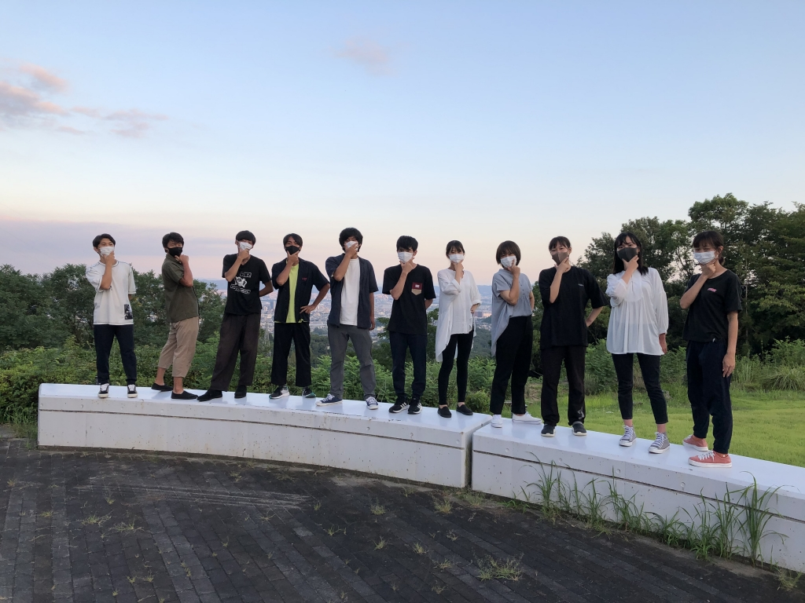

皆さん、こんばんは。殿です。

今日は、なんと最終稽古でした。明日からもう小屋入りです。

光陰矢の如しと言うやつです。

あ、今日のブログちょっと長いかもです。

悪しからず。

さて、この言葉を使いたくはなかったのですが、なんと最後の夏公です。

その稽古が終わったんだなぁと、しみじみ実感しながらこれを書いています。

恒例の回生エチュードなんかもやったりして、炎天下でドレリハして、みんなで写真撮影もして。盛り沢山の1日でした。

なんとも楽しい夏でした。

1,2回生は、みんなとても良い人たちでした。素直で、でもみんな譲れないモノを持っています。夏で一皮剥けた彼らの、これからがとても楽しみです。

どんどん、万を気に入ってもらえると嬉しいなと思ってます。

3回生は、とても頼りになりました。

みんなもう立派な先輩で、僕もたくさん頼らせて貰いました。感慨深いですね。大好きな後輩たちです。

そして同期。今年の夏を彩ってくれた愛すべき仲間たち。奴らと共にならどこまでも楽しめそうなんて思わせてくれました。感謝してもしたりないですね。

そして、今日の帰り道、山から徒歩で高槻へ帰りながら同期と話していて思ったことがありました。それは、5年ぐらい後、10年ぐらい後になっても同期や先輩後輩と万絵巻の公演を見て、酒を飲み交わしたいなと、そんな未来の想像でした。

一瞬で、全力で叶えたい願いになりました。

実は、しんみり気分になるのは卒までお預けにして、毎日を楽しもう。そんな思いで取り組んできた今年の夏公演でした。

だって今が楽しいのに最後だと思って切なくなったら勿体無いなと思いませんか？

でも、駄目でした。最終稽古を終えたらもう寂しい気持ちで一杯です。まだ本番が残ってますから、気を抜くつもりはないんですけど。それでも何かが終わってしまったと感じています。

一番みんなの自由な姿が見られる夏公演。

その成果をもうすぐお届けできます。

配信のため少しタイムラグはありますが、どうか今しばらくお待ちください。

それでは、この辺りで失礼いたします。

写真は、集合写真です。

殿でした。
