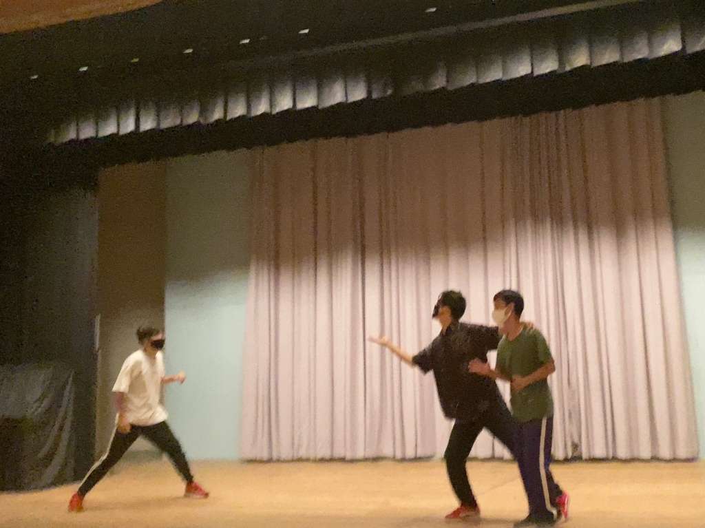

こんにちは～！

真弓です！3回生！

いやー夏ですね～。

この間まで氷結するほど寒い冬だったのが嘘のようです。

昇るアサヒを横目に稽古場に向かう週末の朝。

洗濯済みのフレッシュな稽古着に包まれながら稽古場へと向かいます。

夏本番でカラッとしてスーパードライなS棟。

久しぶりの演劇にも関わらずストロングな演技力を見せてくださる先輩。

初めてながらもスパークリングでスタイルフリーな表現力を持っている後輩。

僕も皆には負けていられません。演技面では適わなくても、スピリット面で対抗します。

声量も自分の中では稽古場で一番搾りだしているつもりです。

そんな後輩に先輩面している自分にうっとりする程ほろ酔いながら、日々の稽古を嗜んでおります。

全てが夏ならではな情景って感じです！

さて、今までの夏と少し違うといえばやっぱり感染対策ですね～

当たり前ですが、感染対策とは常に隣り合わせで稽古に臨んでいます！

常にアルコールが手放せない体になってしまいました。

皆さんも健康には気をつけながら稽古場に来たり、日々の生活を過ごしてください～！！

写真はミュージカルエチュードを企てた演出と巻き込まれたCOWCOWとOBさん！

## 喉元過ぎても熱い物は熱い

お疲れ様です。COWCOWです。

さて、早いものでなんと夏と呼ぶにふさわしい時期になって参りました。私は日焼けする方なので、もうすでに黒く仕上がっていますが、他の皆さんは大変そうですね。痛くなったり、皮がめくれたり。日焼けの対策は練っておきましょう。私もそろそろやばくなっています。特に何もしていない首のあたりが痛くなってきています。シーブリーズをかけるとマシになるというエセリークがあったのでシュッと一吹きしてみると…

うん、うん、大丈……ぎゃああああ！！！

てなかんじにひどいことになりました。しかし、良薬は口に苦し。きっとこれは初めてだからこうなるんだ。(シュッ)

うん……、今回はだああああ！！！

慣れなど来なかった。

例えると、自分の皮膚に火を着けられたような気分でした。誰だよこんなこと言ったやつ。皆さんは用法、容量を正しく守って安全に使いましょう。

さて、昨日はたくさんエチュードをしました。私の(比較的)得意なエチュードはミュージカルで、苦手なエチュードは転あるいは結と、サイレントエチュードですね。見てもらったらわかると思います。まぁ苦手ということは、伸びしろがたくさんあるというわけで()、また直すべき所がたくさんあるということなので、やりがいは感じられます。それがいいかは別として。なにしろ自分が何をしているかを相手に伝わるように工夫しなければならないという点が非常に難しいんですよね。それが転や結となってくると、自身が出てきて物語りになにか変化を付けなければならないので、普通のエチュードでも避けてるのに、それがサイレントにもなるとね、もはや自身がやっていることが正しいのかを疑うレベルになるんです。

ミュージカルといえば、皆さんの歌うときのパートを勝手に考えていたんですよ。なんと、万絵巻、パート分けをすると、非常にバランスが悪い！！！特に男性がテノールに偏り過ぎています。２４期の方が顕著だったような気がしますが、現役の中で考えると、(男性のパートはざっくり言うと高い方から順にテノール、バリトン、バス)。バスは３回生の方に一人、バリトンは自分と４回生の方に一人の計２人。あと全員テノールだと思います。 (ワンチャンもう一人３回生の方がバリトンかも)。皆さん普段の声が高いんですよね。ちなみに誰がどこに入るか予想してみて下さい。1回生の子もそのうち勝手に考えていきます。

キノコがS棟の近くに生えてたんで、それをサムネにしようかと思っていましたが、ちょっと気持ち悪かったのと、写真撮るの忘れてたので、サムネはなしです。

長文になってしまいましたが、これから夏頑張っていきましょーう！

## 喉元過ぎても熱い物は熱い

お疲れ様です。COWCOWです。

さて、早いものでなんと夏と呼ぶにふさわしい時期になって参りました。私は日焼けする方なので、もうすでに黒く仕上がっていますが、他の皆さんは大変そうですね。痛くなったり、皮がめくれたり。日焼けの対策は練っておきましょう。私もそろそろやばくなっています。特に何もしていない首のあたりが痛くなってきています。シーブリーズをかけるとマシになるというエセリークがあったのでシュッと一吹きしてみると…

うん、うん、大丈……ぎゃああああ！！！

てなかんじにひどいことになりました。しかし、良薬は口に苦し。きっとこれは初めてだからこうなるんだ。(シュッ)

うん……、今回はだああああ！！！

慣れなど来なかった。

例えると、自分の皮膚に火を着けられたような気分でした。誰だよこんなこと言ったやつ。皆さんは用法、容量を正しく守って安全に使いましょう。

さて、昨日はたくさんエチュードをしました。私の(比較的)得意なエチュードはミュージカルで、苦手なエチュードは転あるいは結と、サイレントエチュードですね。見てもらったらわかると思います。まぁ苦手ということは、伸びしろがたくさんあるというわけで()、また直すべき所がたくさんあるということなので、やりがいは感じられます。それがいいかは別として。なにしろ自分が何をしているかを相手に伝わるように工夫しなければならないという点が非常に難しいんですよね。それが転や結となってくると、自身が出てきて物語りになにか変化を付けなければならないので、普通のエチュードでも避けてるのに、それがサイレントにもなるとね、もはや自身がやっていることが正しいのかを疑うレベルになるんです。

ミュージカルといえば、皆さんの歌うときのパートを勝手に考えていたんですよ。なんと、万絵巻、パート分けをすると、非常にバランスが悪い！！！特に男性がテノールに偏り過ぎています。２４期の方が顕著だったような気がしますが、現役の中で考えると、(男性のパートはざっくり言うと高い方から順にテノール、バリトン、バス)。バスは３回生の方に一人、バリトンは自分と４回生の方に一人の計２人。あと全員テノールだと思います。 (ワンチャンもう一人３回生の方がバリトンかも)。皆さん普段の声が高いんですよね。ちなみに誰がどこに入るか予想してみて下さい。1回生の子もそのうち勝手に考えていきます。

キノコがS棟の近くに生えてたんで、それをサムネにしようかと思っていましたが、ちょっと気持ち悪かったのと、写真撮るの忘れてたので、サムネはなしです。

長文になってしまいましたが、これから夏頑張っていきましょーう！
