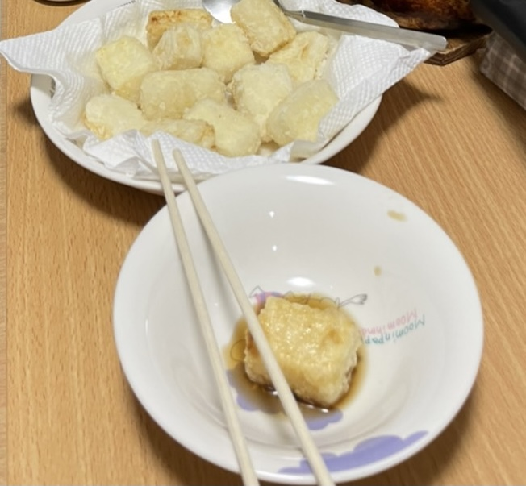

お疲れ様です。こんにちは書記です。

皆さんいかがお過ごしでしょうか。

降り続けていた雨も止んで最近は晴れの日が多くなってきましたね！

S棟の外で稽古した日にはみんな日焼けで真っ赤になっております。

暑くて仕方ないです。私は暑がりというか暑さに弱いんですよね～～、寒いのはまだ頑張れるんですけど暑いのは本当にダメです。

そんな暑がりのせいで夏はメンタルもダメになりがちです。いやメンヘラとかじゃなくて、どうしても取り組んでることに対して気持ちが追いつかないというか、頑張ろうとした瞬間時すでに遅し状態になってるというかそんな感じ。5月病みたいなもんですね。私5月病にはあんまりならないんですけどこんな感じで7月病にはなります。どういうこと？？

まあそんな暗くて楽しくない話をしたいわけではないので夏ってやだよね～って感じでこの話は終わりです。

ただ！！今年は！！！去年とは違って！！！！夏公演がある！！！！！！！

そうなんです。去年って卒公以外無かったらしいですよ。やばない？

7月病とかいってだれてる暇ないですね。

去年夏公演できてたらな～って未だに思うときもありますけど今年できるだけでほんとに嬉しい。マジでこのまま何事もなく打たせてくれ～～

今回の夏公演は後輩の子たちに楽しかったって思ってもらえる夏公演にしたいです。うまく先輩できないかもしれないけど尽力します。よろしくお願いします。

あーーーーーーーーがんばろ！

以上！

## どらごんの酒場のっとります

こんにちは、どうも4回生のコロ助です。

いや、今日は僕らではない方のチーム「どらごんの酒場」に関してお話ししようと思います。

どらごんの酒場という名前を聞いた当初、僕はなんか無性に反抗したくなりました。

ですので、僕は自分で揚げ出し豆腐を作ってあっちのチームの演出のどらごん小次郎にLINEしてやりました。

「こっちの方が酒場でええもん出せるぞ！」

その後、どらごんから返信がきました。

「うちは従業員が優秀なんで、自分で作らんでも大丈夫よ&#128076;」

はい、このブログをみているみなさん、おぼえましたか？

あっちのチームの従業員は素晴らしいものを作ってくださるらしいです

期待してあっちのブログを見てください

そのうち、酒場に素晴らしい料理が並べられている写真が来ると思います笑笑

もし写真こなければ、チーム名を「コロ助の酒場」に変えます笑笑

言いたいこと言えたので今日は以上で終わりにしたいと思います

では、また
