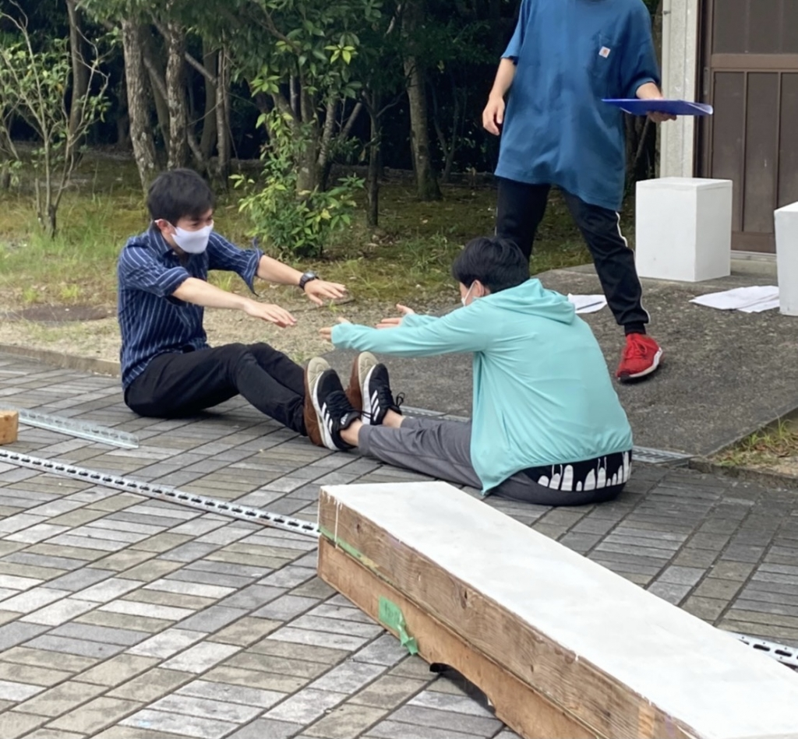

こんにちは。だ。です。

台本を外しての稽古が増えたですよ。

やっぱり台本がないと不安ですが、思い出しながらでもシーン回さないと一向に覚えられないですよね。ほんばんも近くなるとやっぱり焦ってきましたね。シーンももっと作り込んでいかないとやばいなと思っとります。先輩方や同期にはお世話を焼いてもらってます。本当に感謝です。

　ブログ2回目ですが、2回目にして、何を書いていいかわからんかなってきました。これからSNSの方ももくもくしゅうだん契演座では活発化するらしいので、是非是非これからも目を通していただければ幸いであります。私は気の利いたおもしろいブログを書いたり、ツイートをする能力はありませんが、頑張りますのでよろしゅうお願い申し上げます。

## ファインダー越しのブス

こーんにーちはー！！！！！！！！！！

3回生の～～真弓でーーーす！！！！！！！

20歳の大人が付ける「！」の量じゃないですね。

こないだの誤解を招く？ような内容だったブログはちゃんと怒られたんで今回は無しです。

さてそんな話は置いといて、昨日は毎度おなじみパンフ撮影でございました！

衣装を纏い、メイクをして、カメラを構えられ、普段の姿とは一味もニ味も違った一面を晒します。

普段が普段なサークルなだけに、ギャップリティに溢れた姿を見せる方もちらほらと…

それがイケメン画になるか面白画になるかは、本人とカメラマンと衣装さんの時の運＆実力＆ポテンシャルってやつですね！！！

今回は自分は１回生の子がカメラ担当だったんですが、彼がまた乗せ上手なんですよね～

自分もカメラの前で普段のキャラを捨てて色んなポーズを取りつつ素直にレンズに身を任せました⸝⸝⸝⸝

出来栄えはどうなんだって？それは本番をお楽しみに～

さて近況報告を済んだところで、一つそれに関連する理論の話でも。

それぞれの価値観によりますが、世の中にはルックスの優劣というものがあります。

その人の見た目を仮にイジる人がいたとすると、その人は虐げられることによって、性格が歪み、そのストレス等が顔に影響され、さらにブスになるというのです。

このような負の連鎖を「ブサイクル」というらしいです。

僕はこれを知った時、めちゃくちゃ恐ろしい話やと思いましたね。

逆に言えば、植物や雪の結晶等に優しい言葉をかけた上で育ててあげると、よく育ったり結晶そのものが綺麗な形になるというのは有名な話です。

つまり、小学校の頃に習ったいわゆる「ふわふわ言葉」は美化作用があったということかもしれないですね！

ちくちく言葉に溢れた我が稽古場が、このブログを書いた翌日にはふわふわ言葉に溢れていることを願って。

本日のブログは幕引きとさせていただきます。

写真は柔軟してるワシ。

(柔軟ばっかやってんな、この稽古場…)

