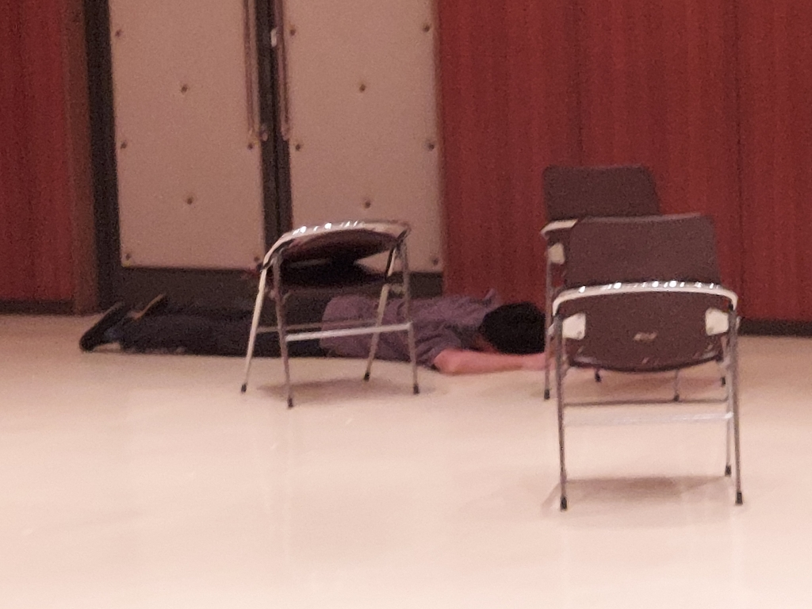

どうも。COWCOWです。

最近は急に雨が多くなり、土砂災害情報なども多くなってしまいました。皆さんどうお過ごしですか？

私は幸いにも土砂災害とはあまり縁の無い地域に住んでいるので、気をつけるものといえば洪水くらいです。油断してはいけませんが。強いて言うなら稽古へ行くために自転車を使いづらいという所でしょうか。特に時間によりますが学校稽古の時にその弊害が顕著に表れます。

ちなみに最近雨を降らしている前線は秋雨前線というもので、その名のとおり秋に降る(であろう)雨をもたらすものでした。いつもなら残暑が厳しいざんしょ～(爆笑ギャグ)とか言ってる時期なので、到底秋と呼べる時期ではありませんね。同時に妙に涼しくなったので稽古しやすいんですが。

今日は余談が続きます。タイトルは本来「天高く馬肥ゆる秋」が正しいことわざなんですが、雨が降るので雲が多く、その分天が低い。また競馬では芝を走る際に芝の状態がぬれているなどで悪いと、差し馬が後方から差す場合により強いパワーを必要とします。逆に逃げ馬のほうも、状態が悪いとスピードが遅くなり、逃げたいのにうまく走れない、差したいのに差しきれないというジレンマが生まれ、その間にあまり注目されていなかった芝悪に強い馬が勝ってしまい、普段のレースよりも結果が荒れてしまいます。本当かどうか知りたい方は今月１４日の三連単の払戻金でも見といて下さい。顕著に表れているレースがいくつかあったと思います。

さて、恒例？の演劇関連の話です。ずいぶん長くなりましたが、こちらも話したいことが多い。私は今回役者として出さしてもらってるんですが、役者をやるたびに思うことが。この役、どこか自分とにているところがあるんじゃないかと。一回目の役者は医者。非常に穏やかで劇唯一の良心とすら言われた役(初期案はどうやらそうでもなかったらしいが)。私はさすがにあそこまで優しい訳ではないが、中学三年間保健安全委員だったこともあり、医者には到底及ばないが少しなら助言できるようになっている。二回目は勇者と魔法使い。魔法使いのほうはかなり内気でキレ散らかす魔王達に話しかけるだけで一苦労。なんとなく小学生の頃に似ている。やはりさすがにあれほどではないが。勇者は大物。人質にも関わらず捕まえた人たちとフレンドリーに話しかける大物。しかも牢屋が壊れていることをいいことに堂々と脱走する大物。やはりここまでではないが度胸はあると言われる。人の前でしゃべるのは別に苦手ではない。三回目は今回。さすがに内容を言うわけにはいかないので詳しくは楽しみにしておきなさいと言うしかないが、第一印象は普段の自分とは全く違う印象。しかし内容を詰めていくにつれて「自分と似たような後悔の仕方してるなぁ」と感じるように。

きっとどんなとち狂った役をやっても、どこか自分と似ている所を探してしまうんでしょうね。さすがに長くなりすぎているので、今回はこのあたりでやめておこうかと思います。

(写真はエチュードが思いもよらぬ展開になりくたばっている我らが大道具のリーダーです)

## 夏の夜のG

皆さんこんにちは、4回生のボスメタモンです！

最近、雨と暑さがしんどいですね～。

そんな季節だからこそ、昨日寝る前に何やら怪しい音が…

奴です。睡眠モードから第一種戦闘配置になりました。

武器を片手に一戦交えてきました。

稽古は何だか最近は凄いことしてます。

音響と合わせるのが楽しみです。

どうなったかは観てからのお楽しみ！！！というか楽しみ！！！
