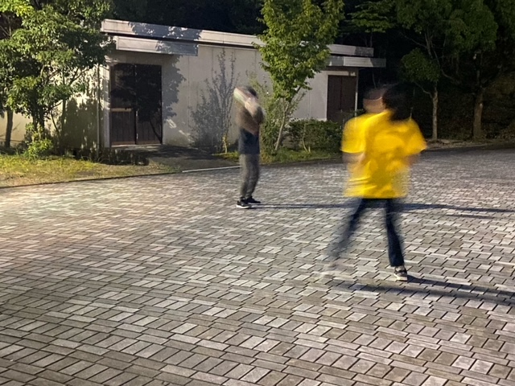

おはようございます。だ。です。

日が経つのは早いもので、9月1日には本番を迎えてしまいます。皆さんで無事に本番を迎えられそうなのはとても嬉しいですが、同時に少し寂しい気もします。本番にわたしとても弱い人間ですが、けっこう頑張れたと個人的に思うので、見せつけてやる気持ちで本番に挑みたいですね。

この写真は。バス待ちが長すぎて。ボール遊びしてまする。いや、、取るの下手かよ

## Q．何で演劇を選んだの？

どうも。

ブログを書く度に何かしらやらかす鬼灯です。

今回は何もありませんように(-\_-;)

さて，もう稽古最終日ですか。あっという間でしたねΣ（゜д゜lll）

「もう8月中旬？早いですね～」と書いていたのが懐かしいです。

更にあと数日で本番…え？もうそんなに迫ってるんですか？

という感じで，本番が迫っている実感は無いです…。

でもそれくらいが丁度いいかもしれないですね。

気が付いたら本番終わってた，が一番緊張せずに出来そうなので笑

色々規制のある状況下でしたが，無事に本番を迎えられそうです。

正直それだけで嬉しいです。満足しています(\*^^\*)

このまま笑って，楽しんで終えられます様に☆彡

あと数日，走り抜けたいと思います。

…ん？タイトルですか？初期の頃に聞かれてた質問です。

ハッキリと答えた記憶がないのでここで答えておこうと思います。

A．何かにチャレンジして，自信のない自分を変えたかったから
