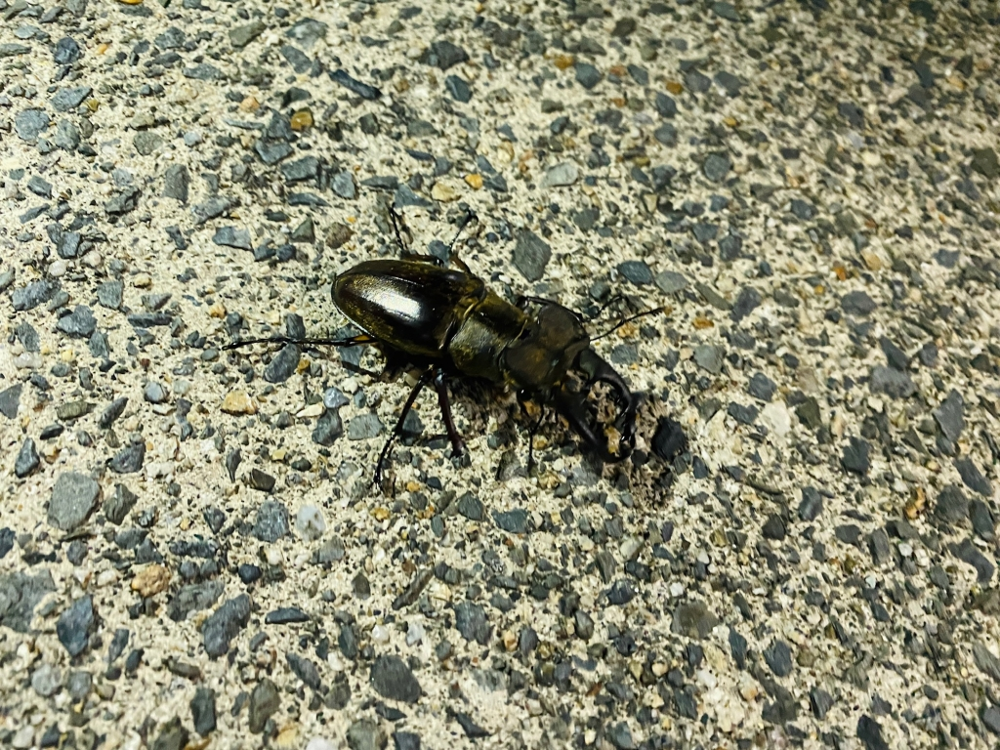

初めましての方は初めまして、ぽん酢です。

わたしは今回の夏公演がはじめての役者なのですが、稽古は毎日すごく楽しくやらせてもらっています。声を出すのってやっぱり気持ちいいですね～というわけで誰か一緒にジャンカラいきましょう！

さてみなさんご存知の通り、S棟にはムカデやらゲジゲジやらゴキブリやら多種多様な仲間たちが暮らしていますが、昨日の稽古帰り、ついにクワガタくんに遭遇！

かっこいいですね～

ツンツンとつついたら慌てていかくしてきました。

強く生きてくれよな。

そんなことがあった翌日、小屋見学が終わり高岳館からs棟に戻っていると、アドニスと片梨がなにかを拾った様子。

なんとそれは、オスのクワガタの頭部😱

まさか…昨日の彼なのか？

この世界は残酷ですね、、、

わたしも明日身体が真っ二つにならない保証はどこにもないので、毎日を悔いなく生きたいなと思いました。

真っ二つと言えば最近チェンソーマンという漫画を読んでるのですがめちゃくちゃおもしろいですね。

読んでる方いたらぜひ語らせてください。何卒。

…ではまたどこかでお会いできますように！
