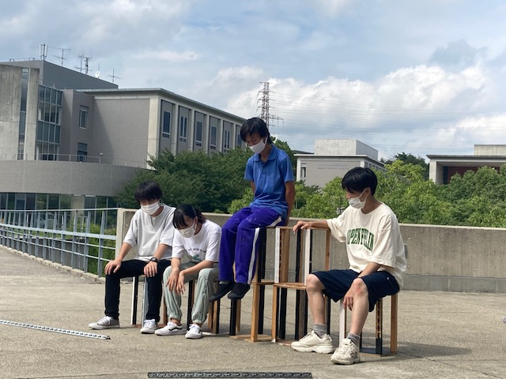
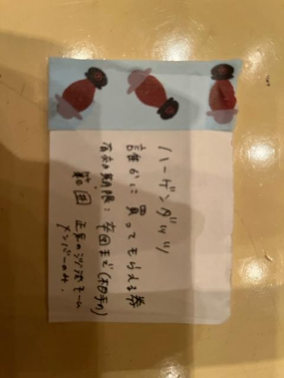

こんにちは。書記です。

稽古もいよいよ大詰め。残り2週間を切りました。役者たちも楽しんで演技できるだけの余裕が出てきたんじゃないでしょうか。

ここで一つ最近の悩みを。

稽古場でつい『喋り過ぎちゃう』のが悩みです。演出という立場は役者に向かってたくさん話す機会があるんですが、私自身お話上手でないのもあって、とにかく質より量！！言葉が足りないから補足説明！！！演出がたくさん話さないと！！！という気持ちになってしまい、稽古場での口数が凄いことになってます。しかも一度スイッチが入るとなかなか抜けないんですよね～、つい話し続けないとと思って雑談のときもめっちゃ喋っちゃいます。あと普通にめっちゃ噛む。

この夏でコミュニケーションがめちゃくちゃ下手になりました。人の話を聞くことも上手にならないとですね…！

そんなところで今日もお稽古頑張ります。

写真は最近の稽古場で熱される方々。サウナか。

## 24日までには絶対掃除します、掃除機は絶対かけます

はじめまして、夏目楓です～よろしくお願いします～

今日は書こう、今日は書こう、今日は書こう、…で今日になってしまいました（涙）普通にすみませんでした(土下座)

夏公演ですね！私は去年の夏公演から参加しているので万絵巻に入って一年と2ヶ月くらい経ったということですね！！びっくりびっくり！すっかり感覚が麻痺してますわ笑笑

みたいな感じで進めようと思ってたんですが…、

もう2週間ない！！(￣◇￣;)

びっくりですね(^\_^;)

なんかもうちょっと遅い気はしますがメモに書いてたこと書こうと思います(やばいとは感じてたので3割くらいの下書きはしてました笑笑)

新入生が入って来てくれて、夏公演に参加してくれてすごくうれしいですね～

最近は母性が溢れ出ます、特に一回生が遠いとこから時間をかけて稽古に来てる思ったら本当によく頑張ったねぇという気持ちになります、

新入生たちよ！！

君たちは偉いよ

毎回よく頑張っているよ

お母さんは体調が心配だよ

ご時世もあって体調管理は本当に大事だからちゃんとしっかり寝てしっかり食べてしっかり遊ぶんだよ！！

これ以上喋るとキモおばあになりそうなのでこの辺でやめます笑笑

私の部屋がきれいになったら宿にして良いからね(つД\`)ノ(わんちゃん夏公の後笑)

そういえば昨日の練習でセブンボーズに最後まで残ったので

ハーゲンダッツチケット貰えました！！！

☆\*:.。. o(≧▽≦)o .。.:\*☆

書いてる通り誰かにハーゲンダッツを買ってもらえる券なのですが…

深くは言いませんが私的にいくつかためらうポイントがあり、めちゃめちゃチケット使いにくいです(°▽°)笑笑

300円以上の価値のある紙になりそうです(￣∇￣)

大事にします笑笑

という感じで終わります！長々と失礼しました

まじであっという間すぎて怖いですが逃げずにがんばります！！笑笑

ありがとうございましたo(^▽^)o

p.s.今日帰ったら、ハーゲンダッツチケットが謎に水没していましたが書記さんが油性ペンで書いてくれてたので助かりました(´༎ຶོρ༎ຶོ\`)
