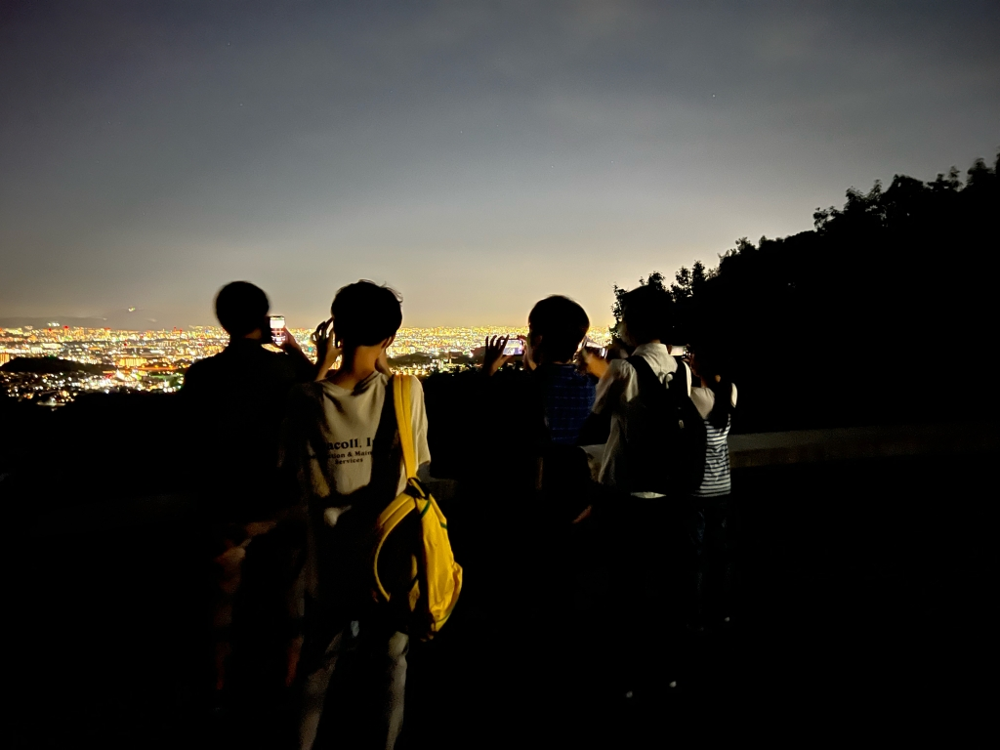

&#65279;おはようございます。

こんにちは。

こんばんは。

どうも、キンヨネです。

なんと、今回の夏演出は私なんです。いやー、驚いている方もいたり、そりゃそうだろと思う方もいると思います。そう、私なんです。何故やろうと思ったか書きたいところですが、こういう思い出話は最後だと思うので、大体2ヶ月後に書くとしますかね。

あー、めんどくさいこと言った…。

ていうことで、今日は役者選考でした。皆んなすごい！ほんと、その一言に尽きます。まずは新入生。ただ一言、元気だねー。上回生は負けんなよ！上回生にも一言、元気だねー。そう、皆んな元気なんです。私疲れます。でも、楽しそうにやってくれて嬉しく思いますし、その姿を見て、やって良かったなと思いもします。だから全員に一言、全力で楽しみやがれ！！

脱線話がないのは自分らしくないので、なんかしときますか。全力という言葉を考えましょう。全力とは、全ての力なんです。つまり、全力で楽しむのは、出る元気全部使い切ってまでも楽しむということなんです。いわば、全力で楽しむのはものすごく疲れることです。しかし、考えてみてください。今までの経験上、しんどかった時の方が思い出すし、話のネタもそっちの方が多いと思いませんか。疲れることは思い出に残るのです。だから、私は言うのです。「全力で楽しみやがれ！！」これは、ただ楽しんでではなく、ものすごく疲れるまで楽しんで、その楽しかったことを思い出として一生持ってほしいという、私の心からの願いですし、演出としての目標なんです。皆んなには、初めに伝えました。遊ぶのを楽しんでください、稽古を楽しんでください、単位を落とさないでください。これは、ただただ言葉として捉えるのではありません。夏の期間は全てに力を

入れてくださいという意味です。確かにしんどいかもしれません。しかし、思い出に残らない夏より、何十倍もましでしょう。最後に言わせてください。

全力で楽しみやがれ！！
