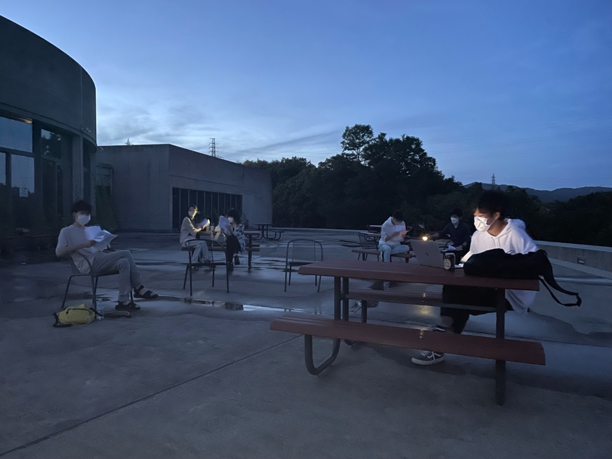

ああ、お久しぶりです。こうしてブログというものを書き散らすのは何ヶ月ぶりでしょうかねぇ。はい、とんとご縁に恵まれませんで、いえご縁に恵まれようとしたかと聞かれれば全くもってそんな事はなく寧ろ最近の私は無聊を託っていた。と恰好の良い言い方をしてみましたが、そんな良いものではなく、呆気なく終わってしまった仕事探しに拍子抜けしつつ一抹の寂しさの中ダラダラしていただけの事。兎に角、筆を取る機会がなかったものですから、探り探りですがまた一寸ずつ頑張って感を取り戻してゆきたいなぁ、なんて益体もない事など考えております。

さて、予てから万絵巻のブログというものを読んでらっしゃる方で、察しの良い聡明な方、とまでは言わずとも、余程の痴呆でなければでここまで読んだ段階で十分、或いは其処は彼となく私が誰なのかと思附くことでしょう。

ええ、四回生ナダルです。

「今日のブログ？演補だからお前な」

という、テキトーなノリで指名されました。

到頭、私も万絵巻でも最高学年になってしまいました。まぁ、私の個人的な問題で現万の最高齢である事も併記しておきましょうか。敢えて深く言及する事はしませんが、皆様が訳を先刻承知であるように、私も皆様がそんな野暮天な方ではないという事を先刻承知だと言うだけのことです。

近況報告でもしましょうかね。やはり夏という事もあるのでしょうか、まさに炎天。けして快適とは言い難くそろそろエアコンの設定温度は26℃かしらん。なんて言いたくなります。

時期的にはギリギリ梅雨と言えなくもないはずですが今年は紫陽花を愛でる間も無く過ぎ去って、枯れた花びらが地面にへばりついているのを見て、汚いなぁ。なんて考える風雅を欠けらも解さない自分がいたりします。ですけど、紫陽花の瑞々しい青を知っている分、茶色く変色して水気のカケラもないカサカサの物体に成り果てているのを見ると、なんともまぁ虚しくなります。付け加えると、あの葉脈が良くないと私は思うわけです。と言うのもですね、枯れて、千切れてコンクリートにへばりついている紫陽花だったものですが、一見するとただのシミのようにしか見えない訳です。それだけなら、辺りを逍遥している人々だって一々気にしたりなんてしません。私だってそうでしょう。しかし、其処に黒々とした葉脈を見付けると、一気にその茶色いシミは綺麗だった花の残骸という物語性を帯びてしまうわけです。そこに命の痕跡が残されているのを知覚した途端なんだかとてもグロテスクなもののような気がして気味悪く感じてしまうのでしょうね。

いったい何の話をしているのでしょうか。近況報告に戻りましょう。

後輩も増えて、私の周りも最近では賑やかになったように感じます。声の圧が明らかに違うわけで小さめの劇場でスピーカーの前に座った時の感触に似ているかもしれません。そう感じるほど後輩たちは元気いっぱいで人工芝を走っている様なんて小学生3年生のようじゃあありませんか。私のような運動不足の老人ではとても着いて行けそうにありません。つい先日も1on1に追い込まれた時には所謂アンクルブレイクを経験させられました。いやはや若さとはある種暴力的ですなぁ。私も小中高とそれなりに努力してきたつもりでしたが諸行無常と言うべきでしょうか。因みに何の話をしているかというとミューズのゼミでやったフットサル大会の話です。後輩というのもゼミの後輩の方です。

炎天下の中、黒チップの敷き詰められた人工芝の上で数時間フットサルに興じるというのはいっそ拷問のようで凄まじい疲労と脱水症状による頭痛は免れませんでした。いえ、私が生来頭痛持ちなせいで発症したのであって、決して熱中症ではないのですが、そしてその後の倦怠感。四肢は鉛を詰められたように鈍く、思考は8bitと言ったところでしょうか。そんな状況でも万は稽古に行かねばなりません。

ははあ、もしかしなくても私は大分ガタがきているのだな。そんな事を思い、今後2ヶ月の夏稽古に臨みます。OB、OGの方は是非手見上げ片手に遊びに来てくだされば。

去年は蚊が怖かったですが、今年は太陽が怖いですね。いえ、別段どうという意味では無いのですが。

写真はクソ暑いL棟から這々の体で逃げ出した。

夏チーム【めちゃYONEキングダム】です。
