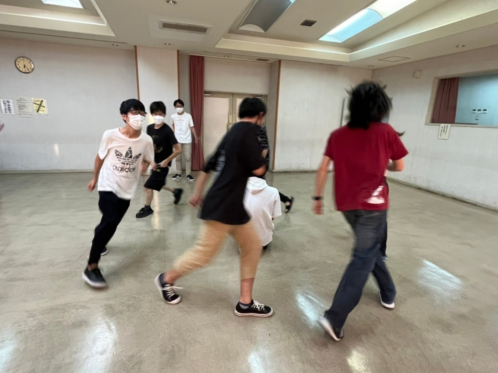

ケース1)お世話になっております。株式会社〇〇の〇〇と申します。

先日は当社選考にご参加頂きまして、誠にありがとうございました。

慎重に選考をいたしました結果、

真弓様につきましてはお見送りとさせて頂くこととなりました。

貴意に沿えず申し訳ございませんでした。

末筆にはなりますが、

真弓様の今後のご活躍を心よりお祈りしております。

この度は当社にご応募下さり誠にありがとうございました。

ケース2)こんにちは。

株式会社〇〇 人事部採用担当です。

先日はお忙しい中、

弊社の2023年度新卒採用の〇次選考にご参加いただき誠にありがとうございました。

さて、選考結果に関して慎重に検討をさせていただきましたが、

今回はご期待に添えない結果となりましたので、ご通知申し上げます。

多数の企業の中から弊社を選び、ご応募頂きましたことを深謝致しますとともに、

真弓さんの就職活動の成功を心からお祈り申し上げます。

ケース3)株式会社〇〇の新卒採用担当です。

先日は弊社の新卒採用〇次面接にオンライン形式でご参加いただき、誠にありがとうございました。

採用担当全員で慎重に選考を進めさせていただいた結果、

今回は活躍できる場所をご用意することはできないという結論に達しました。

限られた採用枠に対して多数のご応募をいただいており、

その中から慎重に審議を重ね、判断をさせていただいた結果でございます。

何卒、ご理解の程よろしくお願い致します。

末筆ながら、貴殿のこれから一層のご活躍をお祈り申し上げます。

……一体何人の人に祈られるんでしょうかね？

わしゃイエスキリストかいうて

こんにちは、真弓です。

さて、このブログの読者層からすると上記の文を読んで色んな頃を思い出して胃が痛くなる層と、「なんじゃこの文？」となって１、２年後にこの意味を知ることになる層の主に2択に分かれると思います！あなたはどっち？

これらの文面はいわゆる「お祈りメール」と呼ばれるもの達です。字の通り、僕の今後の成功やご活躍を「心から」お祈りしています。

がしかし、ここでひとつの疑問が生じます。

果たしてこれを送っている彼らは本当に祈ってるのでしょうか。

そもそも「祈る」というのは、宗教によって意味が異なるが、神など神格化されたものに対して、何かの実現を願うこと。だそうです。

そしてその語源は、「生宣(いの)り」で「い」は生命力、「のり」は宣言を意味する。 ですから「いのり」は『生命の宣言』なのです。

このメールの送信ボタンを押した人達は皆、『生命の宣言』をしているのでしょうか、まぁ常識的に考えてしてないでしょう。逆に面接落ちた人の名前に向かって、一々跪いて十字架を切っている企業があれば見てみたいものです。

つまり各企業は嘘をついているということになります。株式会社〇〇も株式会社〇〇も株式会社〇〇も皆、「心からお祈り」すると口先でだけいって後は忘れ去るという、「君だけを大切にする」と言って恋人を捨て去るプレイボーイ的な口説き文句をしているんです。

そして捨てられた就活生はまた新たな相手を探しにマイナビという街に長い旅に出るのです。その姿はまるで新たなパートナーを探しに結婚相談所に駆け込むシングルペアレントのよう。

これが日本企業の実態なのです。なんて残酷なんでじょう。

新卒カードというもうすぐ満1歳になる息子を抱えたシングルファーザー真弓は今後どうなってしまうのか。

・

・

・

・

・

と、話がヒートアップ脱線したところで、サークルの話題に入りましょうか。深夜テンションでブログを書いてはいけませんね、はい。

みんな書いてますが暑暑暑暑暑暑いんですわ、とにかく。夏公を経験したOB・OGさんはわかると思いますが、毎日が相手チームとのS棟(冷房ガンガン)の取り合いです。ちなみに今日は負けました。何してんねん演出。

そんな暑さに負けない年季組と若さ組のぶつかり合いが毎日当チームでは行われています。

見てください、この写真。稽古でもなんでもないワンシーンなのにこの躍動感。逆にひくわ。

劇の内容に本格的に介入してないのでそんな書けることは少ないですが、もっと思い出増やしてきたいですね～

また写真もいっぱい載せます！SNSも動かします！(向こうがもう既にめっちゃエモいん載せてたけど)

あ、あといい作品も作ります！OB・OGさんも見に来てくださいね～！！(本番だけでなく稽古場とかもとかも)

最後に一つクーイズ！

「就活」とかけまして、「葬式」とときます。

その心は多くの「〇〇〇〇(平仮名4文字)」があるでしょう。

答えは次回ってきた時でも！

おあとがよろしいようで。

以上、真弓がお送りしました～～～～～

## 【株式会社 めちゃYONE】選考結果のご連絡

ケース1)お世話になっております。株式会社〇〇の〇〇と申します。

先日は当社選考にご参加頂きまして、誠にありがとうございました。

慎重に選考をいたしました結果、

真弓様につきましてはお見送りとさせて頂くこととなりました。

貴意に沿えず申し訳ございませんでした。

末筆にはなりますが、

真弓様の今後のご活躍を心よりお祈りしております。

この度は当社にご応募下さり誠にありがとうございました。

ケース2)こんにちは。

株式会社〇〇 人事部採用担当です。

先日はお忙しい中、

弊社の2023年度新卒採用の〇次選考にご参加いただき誠にありがとうございました。

さて、選考結果に関して慎重に検討をさせていただきましたが、

今回はご期待に添えない結果となりましたので、ご通知申し上げます。

多数の企業の中から弊社を選び、ご応募頂きましたことを深謝致しますとともに、

真弓さんの就職活動の成功を心からお祈り申し上げます。

ケース3)株式会社〇〇の新卒採用担当です。

先日は弊社の新卒採用〇次面接にオンライン形式でご参加いただき、誠にありがとうございました。

採用担当全員で慎重に選考を進めさせていただいた結果、

今回は活躍できる場所をご用意することはできないという結論に達しました。

限られた採用枠に対して多数のご応募をいただいており、

その中から慎重に審議を重ね、判断をさせていただいた結果でございます。

何卒、ご理解の程よろしくお願い致します。

末筆ながら、貴殿のこれから一層のご活躍をお祈り申し上げます。

……一体何人の人に祈られるんでしょうかね？

わしゃイエスキリストかいうて

こんにちは、真弓です。

さて、このブログの読者層からすると上記の文を読んで色んな頃を思い出して胃が痛くなる層と、「なんじゃこの文？」となって１、２年後にこの意味を知ることになる層の主に2択に分かれると思います！あなたはどっち？

これらの文面はいわゆる「お祈りメール」と呼ばれるもの達です。字の通り、僕の今後の成功やご活躍を「心から」お祈りしています。

がしかし、ここでひとつの疑問が生じます。

果たしてこれを送っている彼らは本当に祈ってるのでしょうか。

そもそも「祈る」というのは、宗教によって意味が異なるが、神など神格化されたものに対して、何かの実現を願うこと。だそうです。

そしてその語源は、「生宣(いの)り」で「い」は生命力、「のり」は宣言を意味する。 ですから「いのり」は『生命の宣言』なのです。

このメールの送信ボタンを押した人達は皆、『生命の宣言』をしているのでしょうか、まぁ常識的に考えてしてないでしょう。逆に面接落ちた人の名前に向かって、一々跪いて十字架を切っている企業があれば見てみたいものです。

つまり各企業は嘘をついているということになります。株式会社〇〇も株式会社〇〇も株式会社〇〇も皆、「心からお祈り」すると口先でだけいって後は忘れ去るという、「君だけを大切にする」と言って恋人を捨て去るプレイボーイ的な口説き文句をしているんです。

そして捨てられた就活生はまた新たな相手を探しにマイナビという街に長い旅に出るのです。その姿はまるで新たなパートナーを探しに結婚相談所に駆け込むシングルペアレントのよう。

これが日本企業の実態なのです。なんて残酷なんでじょう。

新卒カードというもうすぐ満1歳になる息子を抱えたシングルファーザー真弓は今後どうなってしまうのか。

・

・

・

・

・

と、話がヒートアップ脱線したところで、サークルの話題に入りましょうか。深夜テンションでブログを書いてはいけませんね、はい。

みんな書いてますが暑暑暑暑暑暑いんですわ、とにかく。夏公を経験したOB・OGさんはわかると思いますが、毎日が相手チームとのS棟(冷房ガンガン)の取り合いです。ちなみに今日は負けました。何してんねん演出。

そんな暑さに負けない年季組と若さ組のぶつかり合いが毎日当チームでは行われています。

見てください、この写真。稽古でもなんでもないワンシーンなのにこの躍動感。逆にひくわ。

劇の内容に本格的に介入してないのでそんな書けることは少ないですが、もっと思い出増やしてきたいですね～

また写真もいっぱい載せます！SNSも動かします！(向こうがもう既にめっちゃエモいん載せてたけど)

あ、あといい作品も作ります！OB・OGさんも見に来てくださいね～！！(本番だけでなく稽古場とかもとかも)

最後に一つクーイズ！

「就活」とかけまして、「葬式」とときます。

その心は多くの「〇〇〇〇(平仮名4文字)」があるでしょう。

答えは次回ってきた時でも！

おあとがよろしいようで。

以上、真弓がお送りしました～～～～～
