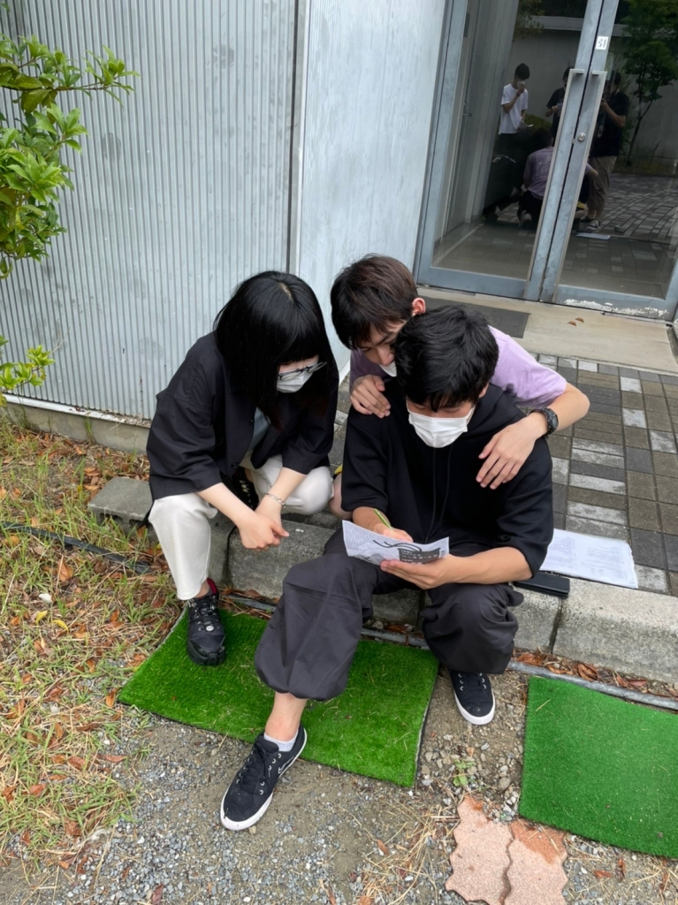

どーもです、花子です。

早速ですが、こっちゃんが1回生と仲良くなり

たいって言ってました。関わり方が分からない

とも…。同じ悩みを持つ者として、議論を交わ

しました。有意義な時間でした。

写真は仲良し3人組です。こちらも1回生と仲良

くなる作戦を考えているのでしょう。真剣な面

持ちです。

今日、なでしが西宮北口に行くと言っていたの

で、兵庫県民はみんな西北って略すんやでって

教えてあげました。そしたら、今度から西北っ

て言うわ！って言っていました。かわいかった

です。

ナダルは相変わらず、セブンのびすけっとをお

行儀よく食べていました。かわいかったです。

よねは、コミュニティルームで寝転がって談笑

していました。ちなみに、みんなは椅子に座っ

ていました。やっぱり少し変なのかなと思いま

した。

真弓、朝テンションが低いのは分かるけど、腰

まで曲がるのはなぜなんでしょう？？

腰とテンションは連動してるのかなと思いまし

た。

だまちゃんはカップラーメンをいつも1分半し

か待たないって言っていました。バリカタ派な

んだなと思いました。

まなやはどこか遠くを見つめながら、微動だに

せずセリフをブツブツ言っていました。ちょっ

と怖かったので、そっとしておきました。

ジキルは髪の毛長かったです。

どこ目指してんねん…。

消し子は台本を忘れて取りに帰ったそうです。

今日も今日とて元気でした。かわいいぞ！

にしきはいつも稽古場にいます。なんか見慣れ

てきて、上回生なのかと錯覚してしまいます。

その落ち着き、嫌いじゃないぞ。

うしみつーーーー！！！また話そうなーー！！

ジョン…………。小道具のジョン…。

以上、今日稽古場にいた人の様子でした。

ではまた～。ぐっばい！

iPhoneから送信
